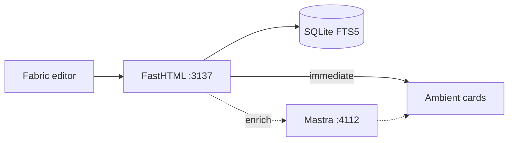

# Personal Note

A local-first spatial notepad with **ambient intelligence** — contextual suggestions that appear briefly while you write and disappear, not a permanent chat assistant. The canvas behaves like a page until content reaches an edge, then grows or shrinks in any direction as text and ink move.

## Documentation

| Document | For |
|----------|-----|
| [docs/PRODUCT-BRIEF.md](docs/PRODUCT-BRIEF.md) | Product north star, verified implementation state, audio-first direction, framework decision |
| [docs/VISUAL-INTELLIGENCE.md](docs/VISUAL-INTELLIGENCE.md) | Scan-triggered concept completion, diagram proposal architecture, timing and evaluation |
| [docs/ARCHITECTURE.md](docs/ARCHITECTURE.md) | System diagram, runtime layout, data flow, file map |
| [docs/INTELLIGENCE-PROTOCOL.md](docs/INTELLIGENCE-PROTOCOL.md) | Wire protocol, provider tiers, local model recommendations |
| [docs/AGENT-WORKSPACE-PROTOCOL.md](docs/AGENT-WORKSPACE-PROTOCOL.md) | Semantic workspace resources, grounded agent reads, proposals, and adapter boundary |
| [docs/INTELLIGENCE-ARCHITECTURE.md](docs/INTELLIGENCE-ARCHITECTURE.md) | Ambient intelligence boundaries, attention policy, planned tools |
| [docs/ROADMAP.md](docs/ROADMAP.md) | Phase-based product roadmap |
| [AGENTS.md](AGENTS.md) | Guide for AI coding agents working in this repo |

## Run locally

```bash
npm install
python -m venv .venv
.venv\Scripts\python.exe -m pip install -r requirements.txt
Copy-Item .env.example .env
npm run dev
```

Open `http://localhost:5173` for the landing page. Its prototype actions enter the notepad directly at `http://localhost:5173/notes`; authentication is intentionally deferred. The Vite client proxies `/api` to the FastHTML server on port `3137`.

`npm run dev` starts Vite, FastHTML, and the intelligence worker together. `python main.py` starts only the standalone FastHTML server and built frontend at `http://127.0.0.1:3137/notes`. If that standalone server is already running, repeating the command prints its URL and exits successfully.

### Local Windows voice

The desktop voice path uses NVIDIA Nemotron 3.5 ASR through a loopback-only CPU service. The one-time setup requires Git, CMake, Ninja, Visual Studio C++ Build Tools, and the Hugging Face `hf` CLI:

```powershell
npm run voice:setup
npm run voice:start
```

Setup pins `NVIDIA/NeMo-Speech.cpp` to commit `b00a5537c71059cf49c1d8e11609af7abd6b4b0b`, builds only its ASR and HTTP components, and downloads `nvidia/nemotron-3.5-asr-streaming-0.6b` Q8 to `%LOCALAPPDATA%\PersonalNote`. The service listens on `127.0.0.1:8080`; run it alongside `npm run dev`. Mobile uses operating-system keyboard dictation, and browser speech remains a best-effort fallback.

`VITE_LOCAL_ASR_ENDPOINT` can override the realtime WebSocket URL at build time. Leave it empty for loopback-local transcription. A hosted `wss://` endpoint processes microphone audio remotely and must not be described as local-only.

## Current capabilities

- Double-click anywhere to type directly on the canvas
- Select, move, resize, edit, recolor, and erase objects
- Pen and translucent highlighter drawing
- Compact 12-color palette with independent Pen and Highlighter width controls
- Tool-attached options: hold Text, Pen, or Highlighter, or tap the active tool, to configure it directly
- Smooth partial stroke erasing, tap-to-dot ink, and legacy path compatibility
- Sticky single-click text placement with `D`/`P`, `E`, `T`, `H`, `V`, and `Escape` quick switches
- Text-first note creation with an immediate focused caret and unobstructed writing surface
- Caret-first text entry with no persisted placeholder objects
- Automatic page expansion and shrinking with edge hysteresis
- Unobstructed live object dragging and page growth on all four canvas edges
- Unified liquid page growth/shrink timing with leading-edge viewport compensation
- Undo and redo for canvas changes
- Confirmed Clear all action that preserves the note and supports immediate undo
- Multiple notes with title editing and autosave
- Two-pane, color-coded notebook and note navigation with drag-to-move organization
- Notebook creation, renaming, recoloring, and deletion with safe note reassignment
- Spotlight-style search across note titles and canvas text, with keyboard navigation
- Compact icon rail with an overlay notebook drawer and note-local properties inspector
- Fixed menu rail with circular, touch-friendly action islands
- Independent rail hover/focus lift with labels and reduced-motion fallback
- Transparent canvas chrome with an expanded, direction-aware top-center Spotlight search pill
- Selection-aware typography controls for font family and size
- Responsive Fabric canvas scaling and compact mobile writing dock
- Capsule writing dock with left Voice and right Scan satellites
- Anchored standalone magnification for Voice, Scan, and note Properties
- Collision-free horizontal tool magnification with opaque lifted controls
- Color-coded rail actions and a global settings placeholder drawer
- Click-to-dictate voice input with live partials, editable finalized canvas text, and a listening edge
- App-owned Windows microphone capture with ordered PCM16 chunks persisted in IndexedDB before local transcription
- Print review with one physical sheet per logical canvas page
- Sharp per-page Fabric exports, boundary clipping, Letter/A4 output, and `Ctrl+P`
- SQLite persistence in `data/personal-note.db`
- Responsive notes drawer and compact mobile tool dock
- Notebook typography using Source Serif 4 and IBM Plex Sans
- Shared soft-flat design language: circular actions, Gmail-style half-pill navigation, and unified typography
- Ambient related-note listening after a meaningful writing pause
- FTS5-backed note search and related-context retrieval
- Fast local person recognition with source-linked person peeks
- Natural-language calendar drafts with explicit `.ics` export
- One-shot contextual suggestions plus an explicit local Page Scan
- Undoable Tidy text layout cleanup
- Scan-only rough box, circle, connector, and arrow proposals with approval-gated refinement
- Source-grounded related-note cards that disappear after their moment
- Local deterministic retrieval with optional Mastra reranking through any OpenAI-compatible model
- Loopback-only Agent Workspace Protocol with stable semantic resources, grounded lexical query, signed cursors, and bearer capability authentication

## Architecture

Three processes in development (`npm run dev`):

```text
Browser (Vite :5173)  →  FastHTML API (:3137)  →  SQLite (FTS5 + notes)
                              ↓ optional, non-blocking
                         Mastra worker (:4112)  →  OpenAI-compatible / Azure model
```



The browser stores Fabric.js canvas JSON through a FastHTML REST interface. `main.py` is the runtime entrypoint, `routes.py` owns the application factory and API registration, `services.py` owns note persistence and retrieval, and `app_schema.py` owns idempotent SQLite setup. `fh-saas` is pinned for future authentication, tenant isolation, jobs, and billing without coupling those concerns to the canvas.

## Connect a local agent

Slice 1 of the Agent Workspace Protocol is available at `POST http://127.0.0.1:3137/api/workspace/v1`. It is read-only, accepts loopback clients only, and supports `workspace.describe`, `resource.get`, and `workspace.query`. On first API startup, a random bearer token is written to `data/workspace.token` unless `PERSONAL_NOTE_AGENT_TOKEN` or `PERSONAL_NOTE_AGENT_TOKEN_FILE` is configured.

```powershell
$token = (Get-Content data/workspace.token -Raw).Trim()
$headers = @{ Authorization = "Bearer $token" }
$body = @{
    protocolVersion = "1"
    requestId = "readme-discovery"
    operation = "workspace.describe"
    input = @{}
} | ConvertTo-Json
Invoke-RestMethod http://127.0.0.1:3137/api/workspace/v1 -Method Post -Headers $headers -ContentType 'application/json' -Body $body
```

Call discovery first and use only advertised operations. Agents receive bounded semantic text and grounded evidence, never raw Fabric JSON or SQLite access. MCP and OpenClaw packages, proposals, canonical mutation, and remote access are future slices.

**Ambient intelligence** is split deliberately. FastHTML returns immediate source-grounded retrieval locally; the browser may then request non-blocking enrichment from a restricted Mastra worker. Mastra may rerank and phrase a connection with one bounded model step — no shell, filesystem, browser, or mutation tools. Without a configured model, the same features run in deterministic `local-retrieval` mode.

See [docs/ARCHITECTURE.md](docs/ARCHITECTURE.md) for the full system diagram, data model, ambient lanes, and file map. See [AGENTS.md](AGENTS.md) if you are an AI agent contributing to this repo.

The settings drawer stores default typography locally and reads safe runtime capability metadata from `/api/settings/capabilities`. Provider keys remain server-side environment values and are never returned to browser code. `fh-saas` includes Google OAuth, session, and tenant provisioning primitives, but authentication is deliberately bypassed in the current single-user development build; setting Google credentials alone does not activate access control.

Drawing analysis is local, deterministic, and runs only when Scan this page is pressed. Fabric pen strokes retain their original points while drawing; there is no timer, background monitor, or per-stroke popup. After the sweep, recognized boxes, ellipses, connectors, and arrows appear as a single refinement proposal. Nothing changes until the user presses Approve, and one Undo restores every original stroke.

Contextual intelligence is text-event-scoped and one-shot. Calendar, person, and related-note cards may appear once after the relevant edit, then disappear rather than becoming recurring reminders. Drawing, erasing, moving, and formatting do not rerun text context. The right-side Scan this page action performs a deliberate 1.4-second sweep, then summarizes dates, known people, grounded related notes, and recognizable drawing gestures. It parses each Fabric text object independently so diagram labels cannot corrupt a nearby calendar phrase.

Fabric selections and Highlighter strokes are explicit attention signals. Selected objects, plus text or diagram gestures intersecting a highlight, appear first with blue priority treatment. Approval actions target the selected drawing batch or selected text group before considering the rest of the page.

Tidy text reserves the padded bounds of every ink and diagram object, then arranges loose text into available space around those obstacles. It never moves or deletes drawing paths, and the complete layout operation remains undoable.

The root `.env` is loaded by both FastHTML and the Mastra worker and is ignored by Git. Start from `.env.example`:

```powershell
Copy-Item .env.example .env
```

For keyless retrieval, leave `PERSONAL_NOTE_MODEL` empty. To invoke a local OpenAI-compatible model such as Ollama or LM Studio, set:

```text
PERSONAL_NOTE_MODEL=qwen3:4b
PERSONAL_NOTE_MODEL_URL=http://127.0.0.1:11434/v1
PERSONAL_NOTE_MODEL_KEY=local
```

For a cloud OpenAI-compatible provider, use its model name, `/v1` base URL, and API key instead. Never put secrets in `.env.example` or commit `.env`. Restart `npm run dev` after changing `.env`, then check `http://127.0.0.1:4112/health`: `local-retrieval` means no model is configured, while `mastra-model` means Mastra will invoke the configured endpoint.

Azure OpenAI and Microsoft Foundry deployments use the official Azure provider. Set `PERSONAL_NOTE_DEPLOYMENT_NAME` to the deployment name, `PERSONAL_NOTE_MODEL_URL` to either its Azure OpenAI endpoint or the Foundry project endpoint, and `PERSONAL_NOTE_MODEL_KEY` to the resource key. Leave `PERSONAL_NOTE_MODEL` empty. The worker derives the Azure resource from a Foundry project endpoint and sends the key using Azure's `api-key` header. Optional legacy deployments can set `PERSONAL_NOTE_AZURE_DEPLOYMENT_URLS=1` and a specific `PERSONAL_NOTE_AZURE_API_VERSION`.


An isolated non-React AG-UI compatibility spike lives in `experiments/ag-ui`. It is intentionally excluded from the production dependency graph and request path; see its README for the compatibility result and adoption criteria.

End-to-end encryption is not implemented. SQLite is a persistence engine, not an E2EE boundary. Before sync or multi-user hosting, the design must define client-held keys, encrypted note payloads and attachments, key recovery and rotation, encrypted search/index tradeoffs, and what plaintext may be disclosed to local or cloud intelligence providers.

`@chenglou/pretext` is installed as the future variable-width text layout engine. The reference implementation in `spatial-docs.html` demonstrates `prepareWithSegments()` and `layoutNextLine()` to flow prose around diagram nodes. The production notepad remains Fabric-based for direct manipulation; Pretext should be introduced as a dedicated spatial text object rather than replacing Fabric's canvas runtime wholesale.

Create a production bundle with `npm run build`; `npm start` serves the FastHTML API and an existing `dist` build.

## Railway deployment

Railway builds the included multi-stage `Dockerfile`, serves the Vite bundle from FastHTML, and checks `/health`. The app works without model credentials; cloud intelligence remains disabled until provider variables are explicitly configured.

1. Create or link a Railway project and deploy with `railway up`.
2. Attach a persistent volume to the service at `/app/data`.
3. Set `PERSONAL_NOTE_DB=/app/data/personal-note.db` and `PERSONAL_NOTE_INTELLIGENCE_TIER=local-only`.
4. Generate a Railway domain for the service and verify `/health` before adding a custom domain.

For optional cloud intelligence, add the relevant `PERSONAL_NOTE_*` model variables from `.env.example` through Railway's Variables UI. Do not upload `.env`. Custom domains are configured in Railway and at the DNS provider; no domain value needs to be hardcoded in this application.

Hosted Nemotron voice runs as a separate CPU service built from `deploy/nemotron`. Attach its own persistent volume at `/models`, set `ASR_CORS_ORIGIN` to the app origin, expose port `8080`, and verify `/ready`. Then set the main app's build-time variable to `VITE_LOCAL_ASR_ENDPOINT=wss://<asr-domain>/v1/realtime` and redeploy the main service. Audio sent to this endpoint leaves the browser and is processed by the Railway ASR service; the `/models` volume is separate from the app's `/app/data` note database volume.