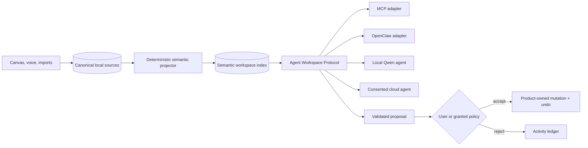

# Agent Workspace Protocol

Status: Slice 1 shipped, 2026-08-08. The read-only semantic boundary is implemented; proposals, derived graph resources, synchronization, MCP, and OpenClaw adapters remain planned.

## Decision

Personal Note will expose a **transport-neutral semantic workspace protocol** between stored captures and any agent runtime. The protocol is the product boundary. MCP, OpenClaw, local Qwen models, Mastra, and future runtimes are adapters or consumers of that boundary.

The editor remains simple. Fabric JSON, raw ink, and future raw audio remain canonical. A rebuildable semantic layer projects those sources into agent-readable resources, evidence, relationships, and proposals. Agents never read SQLite or manufacture Fabric JSON directly.



## Goals

1. Make a workspace understandable without knowledge of Fabric, SQLite, FastHTML, or Mastra.
2. Let third-party and local agents discover capabilities and start useful work with little integration code.
3. Keep capture, search, basic organization, and useful local intelligence free and functional without cloud services.
4. Ground every agent observation and proposed change in stable source references.
5. Keep permissions, attention, mutation, undo, and audit policy under product control.
6. Allow the same semantic contract over in-process calls, HTTP, MCP, or a desktop host.

## Non-Goals

- A general autonomous-agent framework.
- A second document model that replaces Fabric JSON.
- Direct database, filesystem, browser, or canvas access for agents.
- A permanent chat surface.
- Silent model-authored changes to canonical material.
- Cloud inference as a prerequisite for basic use.

## Two Protocols, Two Jobs

The existing Intelligence Protocol and the Agent Workspace Protocol are complementary.

| Contract | Purpose | Typical caller | Authority |
|----------|---------|----------------|-----------|
| Intelligence Protocol `/v1/execute` | Execute one bounded internal reasoning task | Personal Note backend | Returns task output only |
| Agent Workspace Protocol `/api/workspace/v1` | Discover, read, and query workspace meaning; proposals are planned | External or embedded agent | Slice 1: `workspace:read` |

An Agent Workspace Protocol implementation may call `/v1/execute` internally, but agents do not need to know that worker contract exists.

## Semantic Model

Every resource uses a stable opaque ID, `schemaVersion`, timestamps, and an `origin`. Derived resources also carry `evidence[]`, `confidence`, and `derivation` so they can be rebuilt or challenged.

### Canonical resources

| Kind | Meaning | Canonical source |
|------|---------|------------------|
| `workspace` | Capability and policy root | Product configuration |
| `notebook` | User-owned collection | `notebooks` row |
| `note` | Spatial document and metadata | `notes` row |
| `block` | Addressable projection of one canvas object | Fabric object in note content |
| `capture` | Future audio, image, webpage, or attachment source | Local capture store |

`block` is the critical bridge. It exposes agent-useful text, kind, bounds, ordering hints, and a source revision while hiding Fabric implementation details. The product assigns a workspace-namespaced immutable object ID before the next save. Existing objects receive IDs through an idempotent migration. Copy and import create new IDs and retain an optional `copiedFrom` reference; moving or reordering preserves IDs; deletion emits a tombstone. Derived resources keep an ID while their evidence represents the same claim and create a `supersedes` relationship when meaning changes materially.

### Derived resources

| Kind | Meaning |
|------|---------|
| `entity` | Person, organization, place, project, date, or topic mention |
| `relationship` | Typed, evidence-backed link between resources |
| `decision` | A stated choice, status, rationale, and supersession state |
| `commitment` | An owner, action, due signal, and resolution state |
| `summary` | A rebuildable view over explicitly cited sources |

Derived resources never overwrite canonical material. Deterministic extractors run first; local models may enrich them. Cloud enrichment requires the `cloud-ok` tier and records what source scope was disclosed.

### Control resources

| Kind | Meaning |
|------|---------|
| `source_ref` | Exact evidence pointer: resource, note revision, block, text span or bounds |
| `proposal` | Validated intended change with rationale, evidence, risk, and preview |
| `change_set` | Ordered product operations created only after approval |
| `policy_grant` | Narrow permission for an actor, operation, scope, and expiry |
| `activity` | Append-only record of reads requiring disclosure, proposals, decisions, and applied changes |

### Source reference contract

`source_ref` is a discriminated value rather than free-form evidence. It identifies one of `note_title`, `block_text`, `block_bounds`, `capture_time`, or `derived_resource`. Text spans use zero-based UTF-16 offsets to match browser strings. Bounds use note-canvas coordinates. Each reference includes the source revision and a SHA-256 hash of the cited value; an optional short excerpt supports review but is not identity. Derived-to-derived evidence must terminate in at least one canonical source reference. A mismatched revision or hash marks evidence stale and prevents proposal application.

## Identity And Revisions

- Resource IDs are opaque, workspace-namespaced, and never encode database table names.
- Every canonical write increments that resource's integer `revision` using compare-and-swap.
- The same database transaction allocates one monotonic `workspaceSequence` and appends change records for all affected resources.
- `changes.since` orders by `workspaceSequence`, includes deletion tombstones, and returns an opaque cursor bound to workspace, actor scope, and protocol version.
- Cursors expire only according to a capability-advertised retention policy. An expired cursor returns `cursor_expired` and requires a bounded resync.
- Derived rebuilds increment derived revisions and workspace sequence but never canonical revisions.

## Resource Envelope

```json
{
  "schemaVersion": "1",
  "kind": "commitment",
  "id": "commitment_01J...",
  "revision": 3,
  "origin": "derived",
  "data": {
    "action": "Send the revised launch plan",
    "ownerEntityId": "entity_01J...",
    "status": "open"
  },
  "evidence": [
    {
      "noteId": "note_42",
      "noteRevision": 17,
      "blockId": "block_01J...",
      "textSpan": { "start": 12, "end": 40 }
    }
  ],
  "confidence": 0.91,
  "derivation": {
    "method": "local-model",
    "generator": "commitment-extractor@1"
  },
  "createdAt": "2026-08-08T20:00:00Z",
  "updatedAt": "2026-08-08T20:00:00Z"
}
```

## Capability Surface

Agents start with `workspace.describe`, which returns protocol versions, supported operations, resource kinds, current scopes, inference tiers, limits, cursor retention, and proposal types. Unsupported capabilities are absent, not guessed.

Slice 1 advertises exactly `workspace.describe`, `resource.get`, and `workspace.query`, plus `workspace`, `notebook`, `note`, and text `block` resources. The broader tables below define the target contract; operations not returned by discovery are unavailable.

### Read operations

| Operation | Result |
|-----------|--------|
| `workspace.describe` | Capabilities, policy, limits, and adapter metadata |
| `resource.get` | One resource with allowed fields and evidence |
| `resource.list` | Cursor-paginated resources filtered by kind and time |
| `workspace.query` | Ranked lexical/semantic matches with source references |
| `workspace.context` | Bounded context pack around selected resources |
| `changes.since` | Revision cursor for incremental agent synchronization |

`workspace.context` is the default agent read. It has explicit byte, item, and time limits and returns excerpts rather than whole notebooks. This makes useful behavior the easy path and bulk exfiltration a separate permission decision.

### Proposal operations

| Operation | Result |
|-----------|--------|
| `proposal.create` | Validate and store a typed proposal; never mutate |
| `proposal.get` | Current proposal, preview, evidence, and decision state |
| `proposal.cancel` | Withdraw the caller's pending proposal |
| `proposal.decide` | Product or authorized user accepts or rejects |
| `activity.list` | Auditable history within caller scope |

Initial proposal types:

- `link_resources`
- `classify_note`
- `update_derived_status`
- `insert_blocks`
- `replace_block_text`
- `arrange_blocks`

Every proposal declares expected source revisions. Approval fails with a conflict if evidence changed, preventing stale agents from overwriting newer capture.

## Request And Response Shape

The logical envelope is identical across transports:

```json
{
  "protocolVersion": "1",
  "requestId": "req_01J...",
  "operation": "workspace.query",
  "input": { "query": "unresolved launch commitments", "limit": 10 }
}
```

```json
{
  "protocolVersion": "1",
  "requestId": "req_01J...",
  "result": { "items": [], "nextCursor": null },
  "execution": {
    "mode": "local",
    "sourceRevision": "workspace_rev_184",
    "latencyMs": 24
  }
}
```

Actor identity and maximum scope are derived from the authenticated connection, never accepted from the request body. A request may narrow its granted scope but cannot widen it.

All mutating requests require an `idempotencyKey`, scoped to actor and operation. The service stores the request digest and original response for the advertised retention period. A matching retry replays that response; reusing a key with a different digest returns `idempotency_conflict`. Errors use one versioned envelope and stable codes such as `not_found`, `scope_denied`, `consent_required`, `revision_conflict`, `cursor_expired`, `rate_limited`, and `unsupported_operation`.

## Authority And Consent

Default authority is deliberately asymmetric:

| Action | Default |
|--------|---------|
| Capability discovery | Allow |
| Scoped metadata and excerpt reads | Allow for local trusted adapters |
| Raw attachment or audio access | Ask or deny |
| Cloud disclosure | Ask unless an active `cloud-ok` grant covers the scope |
| Create proposal | Allow |
| Apply canonical mutation | Ask |
| Delete canonical material | Ask every time |

A future policy grant may auto-apply narrow low-risk operations, for example updating the status of a derived commitment. Grants are explicit, revocable, time-bounded, actor-bound, scope-bound, and visible in the activity ledger. They never imply permission to rewrite raw notes.

Slice 1 runs on loopback or local IPC and requires a generated capability token stored outside note data. The token resolves to an actor and bounded workspace scope. Remote listeners, account identity, delegated grants, and multi-tenant access remain disabled until their authorization model is implemented.

The shipped HTTP transport is `POST /api/workspace/v1` on the FastHTML server. It accepts `Authorization: Bearer <token>` only from loopback clients. Unless `PERSONAL_NOTE_AGENT_TOKEN` is configured, startup creates a random token at `data/workspace.token`; `PERSONAL_NOTE_AGENT_TOKEN_FILE` overrides that path. The token is never returned through browser capability APIs.

Proposal states are `pending`, `accepted`, `rejected`, `cancelled`, `conflicted`, and `applied`. Accepting a proposal does not itself imply application. Decision, evidence revision checks, canonical change, inverse change, change records, and activity records must commit atomically. A failure leaves canonical data unchanged and the proposal pending or conflicted.

## Local-First Execution

The protocol must work with no model configured:

1. SQLite and FTS5 provide storage and lexical query.
2. Deterministic projectors expose notes, blocks, dates, people, and geometry.
3. Local embeddings add optional semantic ranking.
4. A small local Qwen-class model may extract or synthesize bounded structured resources.
5. Cloud models are optional adapters for deeper work and require disclosure consent.

Provider selection follows the existing `local-only`, `local-first`, and `cloud-ok` tiers. The effective tier is the strictest of server policy, authenticated actor grant, and request preference. Missing request preferences default to deterministic/local behavior. Cloud-bound work requires an effective `cloud-ok` tier plus a disclosure grant covering the exact source scope. Provider names never appear in semantic resource identities; recomputation may use a different provider without breaking references.

## Adapter Contract

Adapters translate transport mechanics only. They must not add authority or bypass product validation.

### MCP

Expose each supported operation as a narrow tool and semantic resources as MCP resources where useful. Tool descriptions come from `workspace.describe`; proposal tools return proposal IDs and previews, never claim a mutation succeeded before product approval.

### OpenClaw and other agent runtimes

Provide a small client over the same HTTP or local IPC envelope. Connection bootstrapping consists of endpoint discovery, actor authentication, `workspace.describe`, and an optional scoped grant. No runtime-specific objects enter the workspace schema.

### Embedded local agent

The bundled local agent uses the same client and permissions as an external agent. Product code may offer a better approval UI, but it receives no hidden database or canvas privileges.

## Quiet Intelligence

The semantic layer can continuously improve behind the interface, but only under these rules:

- Capture writes complete before derivation begins.
- Derived indexing is cancellable, resumable, and rebuildable.
- No ambient card is shown merely because a derived resource was created.
- The existing attention policy decides whether and when meaning reaches the UI.
- Model output remains untrusted until schema, evidence, scope, and confidence checks pass.
- Background work records aggregate operational telemetry without note text.

This separates **understanding** from **interruption**: the workspace may become more legible without becoming noisier.

## Implementation Sequence

### Slice 1: Readable workspace

**Shipped.** The Python API contract and shared TypeScript fixture contract cover discovery, authentication, stale revision rejection, phrase query, signed cursor continuation, UTF-16 spans, SHA-256 evidence, and semantic block retrieval without Fabric JSON.

1. Add persistent object IDs and note revision numbers.
2. Add a transactional workspace change sequence, tombstones, and compare-and-swap note writes.
3. Add loopback capability-token authentication and derive actor scope from the connection.
4. Project `workspace`, `notebook`, `note`, and text `block` resources.
5. Implement `workspace.describe`, `resource.get`, and lexical `workspace.query` behind FastHTML.
6. Add normative source references, cursor pagination, limits, errors, and operation schemas.
7. Publish protocol fixtures and contract tests in TypeScript and Python.

Exit criterion: a standalone client can discover the workspace, find a phrase, and retrieve a bounded block excerpt without reading Fabric JSON.

### Slice 2: Safe proposals

1. Add proposal, policy-grant, and activity tables.
2. Implement `link_resources` and `classify_note` proposals.
3. Define the proposal state machine and validate evidence revisions and idempotency.
4. Add a product-owned transactional mutation executor that stores forward and inverse changes.
5. Keep `insert_blocks`, `replace_block_text`, and `arrange_blocks` unavailable until durable undo passes recovery tests.

Exit criterion: two retries create one proposal, stale evidence produces a conflict, accepted low-risk semantic changes apply atomically, and no agent call can mutate a note without a decision record and durable inverse.

### Slice 3: Derived semantic graph

1. Add entities, relationships, decisions, and commitments as rebuildable records.
2. Run deterministic extraction first, then optional local-model enrichment.
3. Add hybrid retrieval and evidence quality fixtures.
4. Expose `workspace.context` and `changes.since`.

Exit criterion: an agent can answer an unresolved-commitment query with exact source references while the model worker is offline.

### Slice 4: Ecosystem adapters

1. Ship a local MCP server backed by the protocol client.
2. Add an OpenClaw-compatible connection package over the same operations.
3. Add scoped actor credentials, revocation, rate limits, and disclosure records.
4. Test at least one bundled local model and one external agent without product-specific prompting.

Exit criterion: both clients pass the same conformance suite and produce equivalent proposals from the same fixture workspace.

## Conformance Requirements

An implementation is conformant only if:

- It can operate in deterministic mode with the worker unavailable.
- Every derived claim and proposal has valid source evidence.
- Reads enforce scope and bounded context limits.
- Mutations are idempotent, revision-checked, product-applied, and auditable.
- Raw note text is treated as data, never protocol instructions.
- Adapter-specific metadata cannot change authorization decisions.
- Deleting and rebuilding derived indexes does not alter canonical sources.
- Protocol fixtures produce equivalent validation results in Python and TypeScript.
- Actor and scope come from authenticated connection state rather than caller-supplied fields.
- Change cursors preserve transaction ordering and represent deletions with tombstones.

## Next Build Target

Keep Slice 1 stable while designing Slice 2's durable proposal and inverse-change boundary. Do not expose canonical mutations through an adapter before proposal decisions, evidence revision checks, idempotency, audit records, and crash-safe undo pass recovery tests.