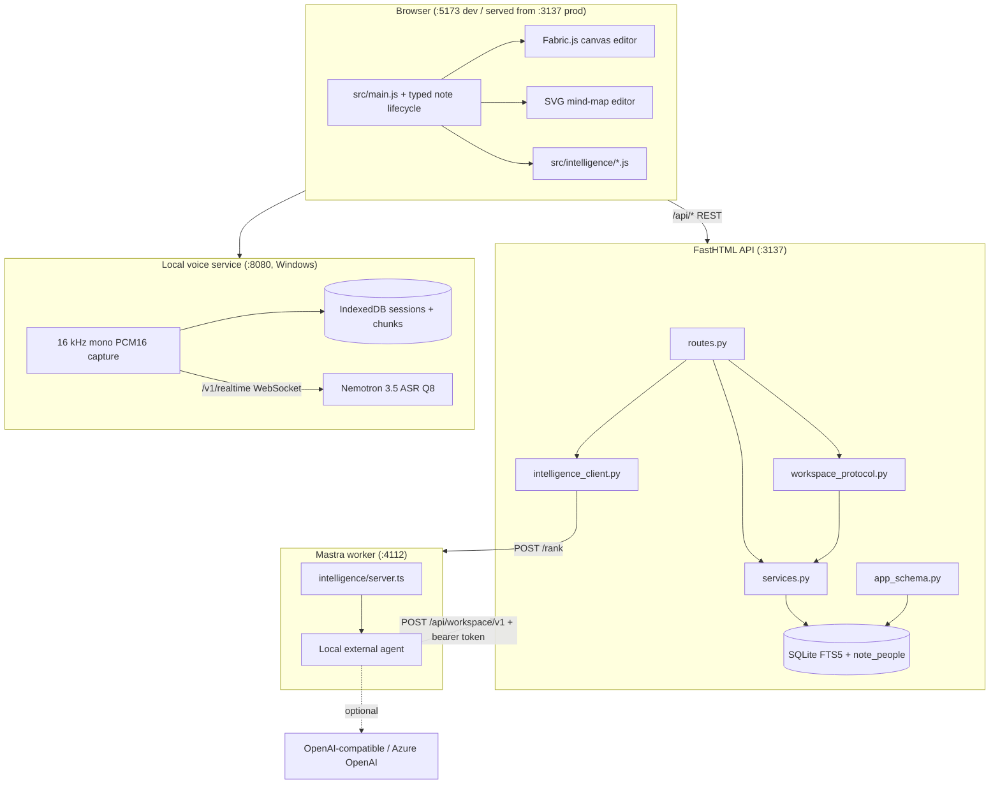
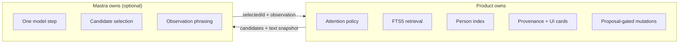
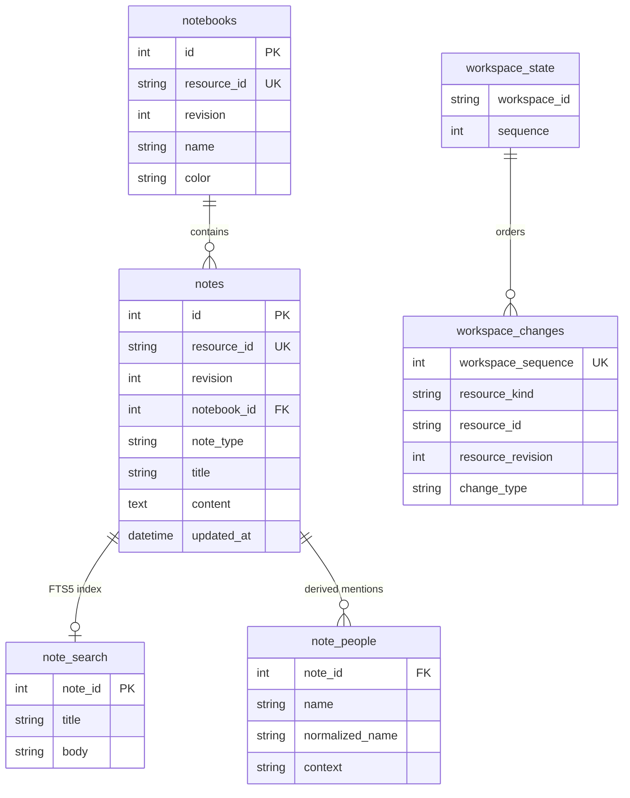
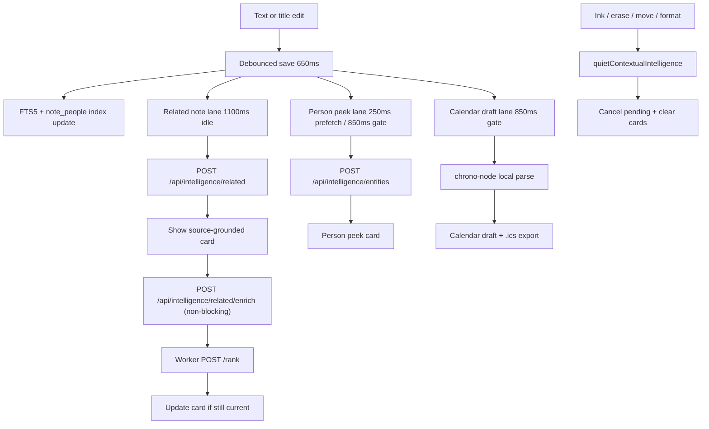
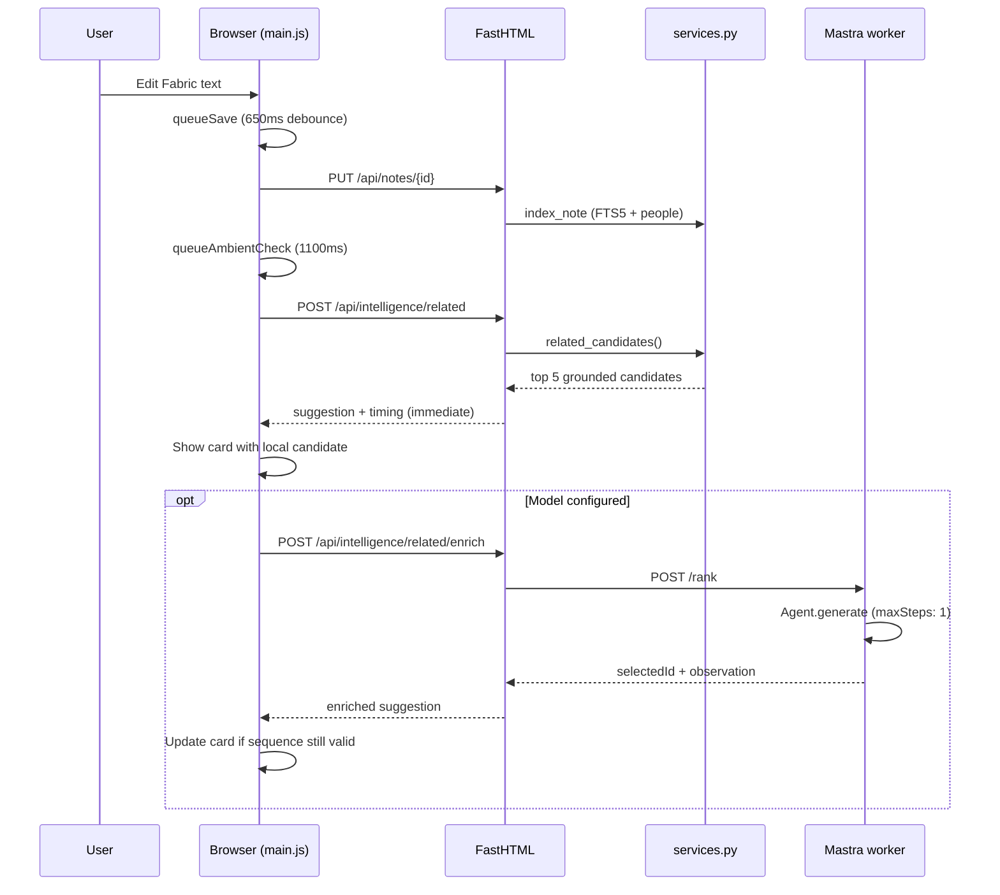
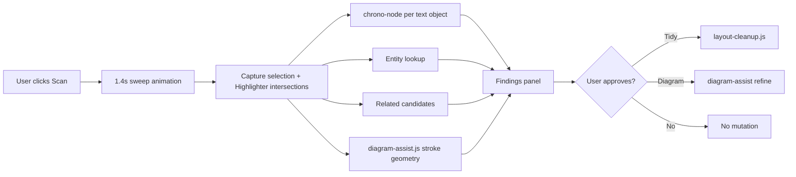

# Personal Note — System Architecture

Personal Note is a **local-first spatial notepad** with **ambient intelligence**: contextual suggestions that appear briefly during writing and disappear, rather than a permanent chat assistant. The product owns retrieval, permissions, provenance, and UI. **Mastra** is an optional, replaceable worker for bounded model execution only.

External and embedded agents integrate through the [Agent Workspace Protocol](./AGENT-WORKSPACE-PROTOCOL.md), a semantic boundary above persistence and below transport adapters. Slice 2 exposes authenticated stable resources plus revision-checked, derived-only link/classification proposals without exposing Fabric JSON, SQLite, or worker internals. Runtime-specific adapters remain planned.

## Runtime Overview

Three core processes run in development (`npm run dev`). Windows local voice adds a separately started loopback service (`npm run voice:start`):



| Process | Port | Technology | Responsibility |
|---------|------|------------|----------------|
| Vite UI | 5173 | Vanilla JS, Fabric.js 7, native SVG, Vite 8 | Typed note lifecycle, canvas and mind-map interaction, ambient orchestration |
| FastHTML API | 3137 | Python FastHTML, uvicorn | REST API, SQLite persistence, local retrieval, worker bridge |
| Intelligence worker | 4112 | TypeScript, `@mastra/core` | Optional one-step rerank + phrasing for related notes |
| Local voice service | 8080 | `NVIDIA/NeMo-Speech.cpp`, Nemotron 3.5 ASR Q8 | Optional Windows realtime local transcription; audio capture remains browser-owned |

Vite proxies `/api` to FastHTML during development. Production serves the built `dist/` bundle from FastHTML.

## Layer Responsibilities



**Product boundary invariants:**

- Each note has an immutable type. Fabric JSON is canonical for `canvas`; normalized map JSON is canonical for `mindmap`.
- Every surfaced observation cites a stored source (note ID, excerpt, timestamp).
- Model failure degrades to local retrieval; the app never fails because the worker is down.
- No consequential write without explicit user approval (calendar `.ics`, Tidy, diagram refine).
- Note text is untrusted input — never agent instructions.
- Mastra types stay inside `intelligence/`; Python and browser code never import `@mastra/core`.

## Data Model

SQLite lives at `data/personal-note.db` (configurable via `PERSONAL_NOTE_DB`).



On every note write, `NoteService.index_note()` updates FTS5 and `note_people` in the same transaction. Canonical writes increment resource revisions and append an ordered workspace change; deletion records a tombstone. Canvas text is extracted from Fabric JSON; mind-map text is extracted from normalized node labels. The complete type-specific JSON remains in `content`. Stable `semanticId` values on Fabric objects let the protocol project canvas text blocks without exposing editor internals; richer agent projection for mind-map nodes remains a separate protocol capability.

`src/main.js` owns the shared note lifecycle and switches editors by `noteType`. A normal New note click creates a canvas note. Holding or right-clicking New note opens the typed chooser. Both types share notebooks, titles, save/delete/clear behavior, and FTS search; editor-only controls are gated by the active type.

## Agent Workspace Protocol

`workspace_protocol.py` owns the transport-neutral Slice 2 surface. `routes.py` exposes it at loopback-only `POST /api/workspace/v1` with a bearer capability token. `workspace.describe` advertises the exact supported surface; `resource.get` projects workspace, notebook, note, and block envelopes; `workspace.query` uses FTS5 and signed, actor-bound cursors; proposal operations apply only revision-checked derived links and classifications. Evidence uses note revisions, stable block IDs, zero-based UTF-16 spans, and SHA-256 value hashes.

This path is independent of the optional Mastra worker and works with no model configured. It supports only product-approved derived proposals (`link_resources` and `classify_note`), recording idempotent decisions, inverse changes, workspace changes, and activity atomically. Canonical block edits, `changes.since`, MCP, and OpenClaw adapters are not shipped.

## Ambient Intelligence Lanes

Ambient means **passive, text-triggered, one-shot context** — not a chat panel.



| Feature | Trigger | Mastra? | User action |
|---------|---------|---------|-------------|
| Related note card | Text edit → save → 1100 ms idle | Optional enrich | Open note / Dismiss; auto-collapse ~8.5 s |
| Person peek | Text edit → 850 ms gate | No | Navigate to source note |
| Calendar draft | Active phrase parse | No | Explicit `.ics` download |
| Page Scan | Explicit dock action (1.4 s sweep) | No | Review findings; Approve Tidy or diagram refine |
| Tidy text | Page Scan approval | No | Undoable layout around ink obstacles |
| Diagram refine | Page Scan approval | No | Undoable stroke → shape conversion |

Each exact calendar, person, or related suggestion surfaces **once per note per browser session**. Page Scan bypasses that ledger and assembles current findings on demand.

## Voice Capture Lane

Windows voice is independent of the intelligence worker. `MicrophonePcmCapture` resamples browser microphone frames to mono 16 kHz PCM16. `DurableAudioSession` serializes each chunk into IndexedDB before `LocalTranscriptionProvider` sends it to the loopback realtime WebSocket. Partial text is display-only; final text is inserted into Fabric and records contextual history, which reuses normal persistence, FTS5 indexing, and quiet ambient checks.

The runtime and model live under `%LOCALAPPDATA%\PersonalNote`, not in the repository. `npm run voice:setup` checks out the pinned native source, builds the CPU ASR/HTTP target, downloads the exact Q8 model, and runs runtime/model validation. Mobile keyboard dictation produces text without app-owned audio. Browser `SpeechRecognition` remains a best-effort fallback.

## Related-Note Data Flow (Detail)



Stale requests are cancelled via sequence counters and `AbortController`. Typing or ink gestures call `quietContextualIntelligence()`.

## Page Scan (Explicit Intelligence)

Page Scan is **deliberate**, not ambient. Its core findings are local and deterministic:



Drawing intelligence analyzes Fabric stroke points locally. No background monitor, no image upload, no Mastra dependency.

The current `/api/intelligence/scan` implementation also awaits optional worker enrichment for scan phrasing before returning. This can delay otherwise-ready local findings when the worker is slow or unavailable. The planned architecture separates the immediate local Scan response from a cancellable semantic diagram-proposal lane; see [VISUAL-INTELLIGENCE.md](./VISUAL-INTELLIGENCE.md).

## File Map

### Entry points

| File | Role |
|------|------|
| `main.py` | FastHTML runtime entry (uvicorn / standalone serve) |
| `routes.py` | `create_app()` factory, REST routes, intelligence API |
| `services.py` | `NoteService`, FTS5 retrieval, person extraction |
| `app_schema.py` | Idempotent SQLite schema setup |
| `workspace_protocol.py` | Authenticated semantic resource projection and bounded query |
| `intelligence_client.py` | HTTP bridge to Mastra worker |
| `src/main.js` | Primary notepad UI (~2900 lines) |
| `intelligence/server.ts` | Worker HTTP server (`/health`, `/rank`) |
| `intelligence/ambient-agent.ts` | Mastra agent definition |

### Browser intelligence modules

| File | Role |
|------|------|
| `src/intelligence/ambient-telemetry.js` | Latency and cancellation metrics |
| `src/intelligence/calendar-draft.js` | chrono-node parsing, `.ics` export |
| `src/intelligence/diagram-assist.js` | Local stroke → box/ellipse/arrow recognition |
| `src/intelligence/layout-cleanup.js` | Obstacle-aware text Tidy |

Deterministic text-to-concept-map proposals with editable ghost previews are implemented. Multi-stroke grouping and semantic completion from raw ink remain planned; see [VISUAL-INTELLIGENCE.md](./VISUAL-INTELLIGENCE.md).

### Configuration

| File | Role |
|------|------|
| `.env` | Shared secrets (gitignored); loaded by FastHTML and worker |
| `.env.example` | Safe template |
| `vite.config.js` | Dev proxy, build config |
| `package.json` | Node scripts and dependencies |
| `requirements.txt` | Python dependencies |

### Future structure (not yet implemented)

See `docs/INTELLIGENCE-ARCHITECTURE.md` for the planned `intelligence/agents/`, `tools/`, `workflows/`, and `schemas/` layout.

The next platform slice is intentionally product-owned rather than worker-owned:

```text
workspace_protocol/
    schemas/       # Transport-neutral semantic resource and operation contracts
    projectors/    # Canonical Fabric/note data -> stable resources
    service/       # Scope, query, revision, proposal, and activity policy
    adapters/      # HTTP first; MCP and external runtimes later
```

## API Surface (Intelligence)

| Method | Path | Purpose |
|--------|------|---------|
| `GET` | `/health` | App health |
| `GET` | `/api/settings/capabilities` | Safe runtime metadata (no secrets) |
| `POST` | `/api/intelligence/related` | Immediate local related-note candidate |
| `POST` | `/api/intelligence/related/enrich` | Non-blocking Mastra enrichment |
| `POST` | `/api/intelligence/scan` | **Unified page scan** (calendar, people, related, tidy hints) |
| `GET` | `http://127.0.0.1:4112/health` | Worker mode: `local-retrieval` or `mastra-model` |

## Tech Stack Summary

| Area | Choice | Notes |
|------|--------|-------|
| Canvas | Fabric.js 7 | Direct manipulation; JSON persisted to SQLite |
| Frontend | Vanilla JS ES modules | No React in production path |
| Backend | FastHTML + uvicorn | `fh-saas` pinned for future auth/tenancy |
| Database | SQLite + FTS5 | Local-first; not E2EE |
| AI runtime | Mastra 1.x | Single agent, no tools, replaceable |
| Models | OpenAI-compatible or Azure | Optional; keyless mode always works |
| Calendar | chrono-node | Fully local |
| Future text layout | `@chenglou/pretext` | Reference in `spatial-docs.html`; not in prod canvas yet |

## Security and Future SaaS

- Authentication is **bypassed** in the current single-user dev build. `fh-saas` Google OAuth primitives exist but are not active.
- Provider keys live in server-side `.env` only; `/api/settings/capabilities` never returns secrets.
- The Mastra worker binds to `127.0.0.1` and exposes only `/health` and `/rank`.
- E2EE is not implemented. See `README.md` and `docs/ROADMAP.md` Security Track before sync or multi-user hosting.

## Related Documentation

| Document | Contents |
|----------|----------|
| [INTELLIGENCE-ARCHITECTURE.md](./INTELLIGENCE-ARCHITECTURE.md) | Intelligence boundaries, attention policy, planned tools |
| [ROADMAP.md](./ROADMAP.md) | Phase-based product roadmap |
| [../AGENTS.md](../AGENTS.md) | Guide for AI coding agents working in this repo |
| [../experiments/ag-ui/README.md](../experiments/ag-ui/README.md) | AG-UI spike results (deferred for ambient path) |
| [../PORTABLE-FASTHTML-SAAS-APP-FRAMEWORK-SPEC.md](../PORTABLE-FASTHTML-SAAS-APP-FRAMEWORK-SPEC.md) | Future SaaS framework spec |
