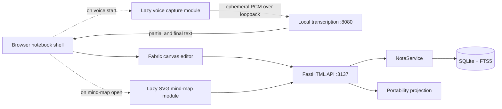
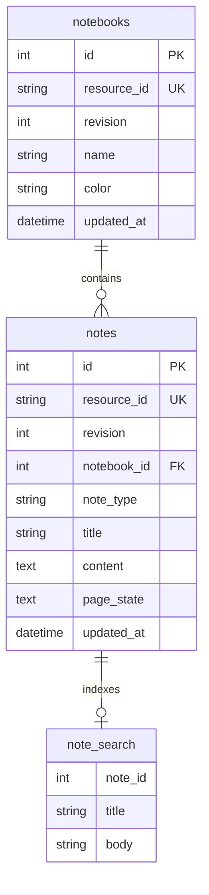

# Personal Note v1 Architecture

Personal Note v1 is a local, single-user notebook with one required runtime path and two optional built-in editor/capture modules. The core does not load or call a reasoning worker.

## Runtime

Development uses two core processes:

| Process | Port | Responsibility |
|---|---:|---|
| Vite | 5173 | Browser shell, canvas, and lazy built-in modules |
| FastHTML | 3137 | REST API, SQLite persistence, search, backup/import/export |

The optional Windows transcription service listens on loopback port `8080` and starts separately. The notebook is fully usable when it is absent.

## Core boundaries

### Browser shell

`src/main.js` owns shared note lifecycle and canvas interaction. It talks to the backend only through `src/core/api.js`. The shell knows that notes have a `noteType`, but optional modules do not own notebook navigation, persistence, or search.

### Persistence

`routes.py` defines the local HTTP surface. `services.py::NoteService` is the only owner of canonical note and notebook reads/writes. `app_schema.py` performs idempotent schema creation and migration. All endpoints work without voice or mind-map code running in the browser.

A note type is immutable after creation:

- `canvas` stores Fabric JSON plus `{columns, rows}` page state.
- `mindmap` stores normalized map JSON in the same `notes.content` column.

Every write increments an integer revision. A caller that supplies a stale revision receives HTTP 409. FTS5 indexing is updated in the same transaction as note content, using Fabric text or mind-map node labels.

### Optional built-in mind map

`src/modules/mindmap.js` is the shell-facing boundary. Its only job is to lazy-import the SVG editor and return the established editor lifecycle (`getDocument`, `setTitle`, `destroy`). The module receives a host element and an `onChange` callback. It uses the normal note API and introduces no separate database or library.

The editor chunk is fetched only when a mind-map note opens. Canvas notes created before this boundary continue to load unchanged.

### Optional built-in voice capture

`src/modules/voice/` contains three responsibilities:

- `transcript-session.js` separates unstable partial text from committed transcript text.
- `microphone-pcm-capture.js` emits in-memory mono 16 kHz PCM frames.
- `local-transcription-provider.js` exchanges those frames for transcript events over a loopback WebSocket.

`capture.js` is dynamically imported only when desktop voice starts. There is deliberately no audio repository. PCM frames are not written to IndexedDB, SQLite, the filesystem, backups, or exports. Final transcript text is inserted through the same Fabric history/save path as typed text. Browser speech may be offered as a clearly labeled fallback; if neither provider is available, the UI explains how to start the local service.

### Portability

`portability.py` depends on the storage service's snapshot/import methods:

- `GET /api/export/workspace` returns the versioned, lossless JSON contract.
- `POST /api/import/workspace` validates the entire payload, then merges copied notebooks and notes in one transaction.
- `GET /api/export/markdown` returns a readable ZIP projection with a manifest and extracted embedded image assets.

Import never deletes or overwrites existing notes. New local resource IDs are assigned, and conflicting canvas object IDs are regenerated. This gives users a safe restore path without inventing sync or conflict-resolution semantics.

## Data model

`resource_id` is stable inside a workspace and keeps exports independent from local row IDs. Import intentionally creates copies with new resource IDs. Existing installations may retain unused legacy tables; v1 neither reads nor populates them, avoiding destructive database migrations.

## API surface

| Method | Path | Responsibility |
|---|---|---|
| `GET` | `/health` | Core process health |
| `GET` | `/api/settings/capabilities` | Storage, portability, and built-in module facts |
| `GET/POST` | `/api/notebooks` | List/create notebooks |
| `PUT/DELETE` | `/api/notebooks/{id}` | Update/delete notebook; note reassignment is transactional |
| `GET/POST` | `/api/notes` | List/create notes |
| `GET/PUT/DELETE` | `/api/notes/{id}` | Canonical note lifecycle |
| `PATCH` | `/api/notes/{id}/notebook` | Move a note |
| `GET` | `/api/search?q=` | FTS5 note search |
| `GET` | `/api/export/workspace` | Canonical JSON backup |
| `POST` | `/api/import/workspace` | Non-destructive merge import |
| `GET` | `/api/export/markdown` | Markdown-plus-assets ZIP |

There are no v1 model, suggestion, agent, or remote workspace endpoints.

## Performance shape

The default canvas route statically loads Fabric and the shell. Voice capture and mind-map implementation code are separate dynamic chunks. `npm run benchmark:bundle` enforces aggregate JavaScript gzip, aggregate CSS gzip, and largest JavaScript chunk budgets. The screen theme is isolated in `src/workspace-theme.css` under `@media screen`, so print output continues to use the established print rules.

## Security and deployment boundaries

- The API binds to `127.0.0.1` by default.
- SQLite is local storage, not encryption.
- V1 has no authentication, tenancy, sync, or remote API contract.
- No secret or provider credential is sent to the browser.
- Imported backup content is treated as data and validated for format, note type, references, and size before insertion.
- Markdown conversion never fetches remote image URLs; only bounded embedded data images are extracted.

## File map

| File | Role |
|---|---|
| `src/main.js` | Notebook shell and Fabric canvas |
| `src/core/api.js` | Browser API boundary |
| `src/modules/mindmap.js` | Lazy mind-map boundary |
| `src/mindmap/` | Built-in mind-map implementation |
| `src/modules/voice/` | Transcript, capture, and local provider modules |
| `routes.py` | Core HTTP routes |
| `services.py` | SQLite persistence and FTS5 indexing |
| `portability.py` | Backup/import and Markdown archive projection |
| `app_schema.py` | Idempotent database setup |
| `src/workspace-theme.css` | Screen-only Omarchy-style chrome |
