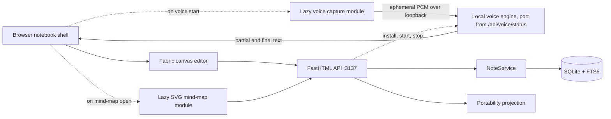
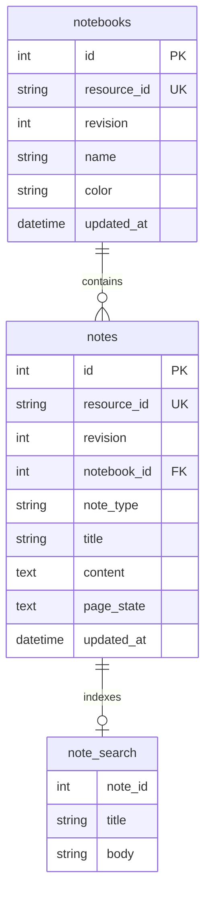

# Personal Note v1 Architecture

Personal Note v1 is a local, single-user notebook with one required runtime path and two optional built-in editor/capture modules. The core does not load or call a reasoning worker.

## Runtime

```mermaid
flowchart LR
    Shell[Browser notebook shell] --> Canvas[Fabric canvas editor]
    Shell -. on mind-map open .-> Map[Lazy SVG mind-map module]
    Shell -. on voice start .-> Voice[Lazy voice capture module]
    Voice -->|ephemeral PCM over loopback| ASR[Local voice engine, port from /api/voice/status]
    API -. install, start, stop .-> ASR
    ASR -->|partial and final text| Shell
    Canvas --> API[FastHTML API :3137]
    Map --> API
    API --> Store[NoteService]
    Store --> DB[(SQLite + FTS5)]
    API --> Export[Portability projection]
```

Development uses two core processes and one local command interface:

| Surface | Port | Responsibility |
|---|---:|---|
| Vite | 5173 | Browser shell, canvas, and lazy built-in modules |
| FastHTML | 3137 | REST API, SQLite persistence, search, backup/import/export |
| `personal_note_cli.py` (`bin/personal-note`) | — | Local agent and scripting interface: search, read as text, create, append, import/export, diagnostics, all through `NoteService` |

The desktop app (`desktop.py`) replaces both with one process: uvicorn serves the built `dist/` and the API on a free loopback port in a background thread, and a pywebview window loads it. On close it calls the page's `window.personalNote.flush()` (resolves once nothing is unsaved; bounded to 3 seconds), then destroys the window and stops the server. A per-database `*.desktop.json` record (with a random nonce) and a loopback `POST /_desktop/focus` that requires that nonce give single-instance behaviour. The web view keeps a persistent context so `localStorage` exists; the frontend also tolerates its absence. `app_paths.py` (standard library only) picks the database: `PERSONAL_NOTE_DB`, else an existing legacy `data/personal-note.db` (until `personal-note migrate-data` has copied it to app-data), else the app-data folder. `migration.py` implements the explicit copy.

The optional Windows transcription service listens on loopback port `8080` and starts separately. The notebook is fully usable when it is absent.

## Core boundaries

### Browser shell

The Fabric canvas is always window-sized: pan and zoom move `viewportTransform` (geometry in `src/modules/editor/viewport.js`), page tiles are painted in `before:render`, and page growth only changes the page count. `npm run benchmark:canvas` measures drag, grow, pan and zoom frame times on a generated 600-object note.

Pending edits are flushed when the page is hidden or closed (`src/modules/editor/save-flush.js`): a keepalive request survives unload but is capped at 64 KiB, so a note over about 60 KiB is saved on close best-effort with a normal request that the browser may cancel. If a save is already in flight at that moment, the close-time save is sent at once with the last confirmed revision (never a guessed one); if the in-flight save lands first the server rejects it with a conflict rather than overwrite anything, so edits made after that save can be lost.

The chrome floats over that canvas (F-004): a glass sidebar (Quick note, Inbox, notebooks grouped by PARA category with their notes), a top bar (breadcrumb, title, save state, agent chip, search, share/export), a bottom dock (tools, ink swatches, undo, mic), a page minimap and a zoom control. Pure helpers keep the logic testable: `src/modules/library/outline.js` (sidebar grouping), `src/modules/editor/navigation.js` (page label, zoom steps, fit, minimap, scroll thumbs), `keyboard-pan.js`, `edge-ghost.js` (the "+ Page N" preview) and `lift.js` (a dragged object's tilt and shadow). The ghost page and the lift are painted only while dragging and are never saved objects. The chrome is screen-only and lives in `src/chrome.css`.

Objects and the desk (F-012): a note opens zoomed out so every page is on the desk (`openingView` in `navigation.js`; phones keep the full-width first page), with "Page N" under each page and dashed fold lines between pages, all painted by the canvas and never saved. The dock's Sticky note, Shape and Image tools create ordinary canvas objects: a sticky is a `Sticky` Textbox subclass (`sticky-object.js`, registered with Fabric so it loads, prints and exports like text; `stickyColor` is saved), a shape is a rounded `Rect`, and an image is a Fabric image stored as a data URL (shrunk to 1400 px on its longest side; picker or drop). `objects.js` holds the pure rules (palette from the skin's `--sk-c1..c5`, defaults, image sizing). Crayon's screen paper is white; Paper (the default skin) and Night keep their ivory, and print is unchanged.

`src/main.js` owns shared note lifecycle and canvas interaction. It talks to the backend only through `src/core/api.js`. The shell knows that notes have a `noteType`, but optional modules do not own notebook navigation, persistence, or search.

### Persistence

`routes.py` defines the local HTTP surface. `services.py::NoteService` is the only owner of canonical note and notebook reads/writes. `app_schema.py` performs idempotent schema creation and migration. All endpoints work without voice or mind-map code running in the browser.

A note type is immutable after creation:

- `canvas` stores Fabric JSON plus `{columns, rows}` page state.
- `mindmap` stores normalized map JSON in the same `notes.content` column.

Every write increments an integer revision. A caller that supplies a stale revision receives HTTP 409. FTS5 indexing is updated in the same transaction as note content, using Fabric text or mind-map node labels.

### Optional built-in mind map

`src/modules/mindmap.js` is the shell-facing boundary. Its only job is to lazy-import the SVG editor and return the established editor lifecycle (`getDocument`, `setTitle`, `destroy`). The module receives a host element and an `onChange` callback. It uses the normal note API and introduces no separate database or library.

The editor chunk is fetched only when a mind-map note opens. Canvas notes created before this boundary continue to load unchanged.

### Optional built-in voice capture

`src/modules/voice/` contains three responsibilities:

- `transcript-session.js` separates unstable partial text from committed transcript text.
- `microphone-pcm-capture.js` emits in-memory mono 16 kHz PCM frames.
- `local-transcription-provider.js` exchanges those frames for transcript events over a loopback WebSocket.

`voice-setup.js` turns the server's voice status into the Settings › Voice section and decides what the mic button does when voice is not ready (a short reason, then Settings opens). It is in the main chunk because Settings needs it at once; it stays small to keep the bundle budget.

`voice_runtime.py` (stdlib only; `routes.py` exposes it under `/api/voice/*`) owns everything outside the page: it downloads the engine (a per-OS tarball from the release matching the running version, falling back to the latest) and the model (Hugging Face, pinned revision), resumes partial `.part` files, verifies SHA-256 and size, unpacks safely, and writes `installed.json` last, so an interrupted install is never mistaken for a finished one. It also runs the engine process: `desktop.py` starts it when voice is installed and stops it on close; `main.py` stops it at exit, and the page can start it on demand through `POST /api/voice/engine/start`. The engine binds `127.0.0.1` only, on port 8080 when free and another free port otherwise, so the page reads its WebSocket address from `/api/voice/status` instead of assuming 8080. A crashed engine is restarted once. The state-changing routes require an `X-Personal-Note` header, which another web page cannot send without a CORS preflight the server never answers. Everything lives in `app-data/voice/`; `remove` deletes that folder only. Windows and CPUs without a release engine report `unsupported`, and the page keeps the older "look for a service on port 8080" behaviour there.

`capture.js` is dynamically imported only when desktop voice starts. There is deliberately no audio repository. PCM frames are not written to IndexedDB, SQLite, the filesystem, backups, or exports. Final transcript text is inserted through the same Fabric history/save path as typed text. Browser speech may be offered as a clearly labeled fallback; if neither provider is available, the UI says why and opens Settings › Voice. In the app windows the browser fallback is never used.

### Portability

`portability.py` depends on the storage service's snapshot/import methods:

- `GET /api/export/workspace` returns the versioned, lossless JSON contract.
- `POST /api/import/workspace` validates the entire payload, then merges copied notebooks and notes in one transaction.
- `GET /api/export/markdown` returns a readable ZIP projection with a manifest and extracted embedded image assets.

Import never deletes or overwrites existing notes. New local resource IDs are assigned, and conflicting canvas object IDs are regenerated. This gives users a safe restore path without inventing sync or conflict-resolution semantics.

## Data model

```mermaid
erDiagram
    notebooks ||--o{ notes : contains
    notes ||--o| note_search : indexes

    notebooks {
        int id PK
        string resource_id UK
        int revision
        string name
        string color
        datetime updated_at
    }
    notes {
        int id PK
        string resource_id UK
        int revision
        int notebook_id FK
        string note_type
        string title
        text content
        text page_state
        datetime updated_at
    }
    note_search {
        int note_id
        string title
        string body
    }
```

`resource_id` is stable inside a workspace and keeps exports independent from local row IDs. Import intentionally creates copies with new resource IDs. Existing installations may retain unused legacy tables; v1 neither reads nor populates them, avoiding destructive database migrations.

### Engine-independent document model (F-025, not yet in use)

Notes still persist as Fabric JSON; invariant 2 is unchanged. `src/core/document/` and its Python mirror `document_model.py` define the plain-data model that F-026 will persist instead, so the canvas engine can change (ADR 0001) without a second format change. `fromFabric`, `toFabric` and `geometry.js` are the only code that knows Fabric's conventions; the model and the engines that read it do not.

- A document is `{schemaVersion, page: {columns, rows}, objects, extras}`. Each object has `id` (= `semanticId`), `type` (`text`, `sticky`, `shape`, `ink`, `image`, `connector`, `group`, or `unknown`), `z` (stacking order), `geometry` and typed fields per type. `schema.js` is the field reference.
- Frames: positions are in page pixels, x right and y down, from the top-left of the first page. `geometry` is `{x, y, width, height, rotation, scaleX, scaleY, flipX, flipY, skewX, skewY}`: the box is `width` x `height` with its top-left at `(x, y)` (stroke not included); with centre `c`, a point `p` lands at `c + Rotate(rotation) * Scale(flip) * SkewX * SkewY * (p - c)` (SkewY acts first; skews are `tan(degrees)`; rotation is clockwise degrees about the box centre). There are no origins. A text block saved without a height (an agent-written Textbox) has no `height` in the model; its rotation, scale and skew only mean something once the engine has measured the height, so an adapter measures first. A group's children are in the group's box frame (origin at its top-left). An ink stroke's `path` and `points` are relative to its box's top-left corner, so nothing depends on Fabric's `pathOffset`.
- `opacity`, `visible`, `strokeUniform` and a simple `shadow {color, blur, x, y}` are typed. Per-character text styles (not used by any feature) stay in `extras`.
- Other fields are sparse: present only if the stored note had them. Fabric properties without a typed field (defaults like `fillRule`) stay in the object's `extras`, so nothing is dropped. Object types the model does not know, objects with malformed placement, and ink paths using commands other than absolute M/L/Q/C/Z are kept whole in `raw`.
- `fromFabric(content, pageState)` and `toFabric(doc)` are pure. `toFabric(fromFabric(x))` is render-equivalent to `x`: every box corner and ink point lands within 1e-6 of where Fabric puts it, proved with Fabric's own matrices on every fixture and a set of rotated, scaled, flipped, skewed, stroked and nested-group objects. Everything that is not placement is exactly equal. What changes, and only that: Fabric's origin convention is normalised (`originX`/`originY` come back as `center` with `left`/`top` the box centre; an object saved without a height keeps top-left), ink path numbers are translated into the box frame and back (rounding of ~1e-13) and an ink path's width and height come back as Fabric measures them rather than the 4-decimal saved values. `arrowheads`, `colorKey` and `fillKey` are derived on the way in and ignored on the way out.
- The highlighter's `#rrggbb55` colour is split into `color` and `alpha`; any other colour spelling is kept whole.
- Pictures are `mediaRef`: `{kind: 'inline', dataUrl}` today, `{kind: 'media', id}` once the media library exists (`toFabric` takes a `resolveMedia` function for those).
- `validateDocument` lists problems with their paths, with identical wording in JS and Python. Missing, empty and duplicate ids are errors there but still convert, so old notes load.
- `search_text` in `document_model.py` returns exactly what `NoteService.canvas_text` returns now. `plain_text` has the same blocks as `note_text.py` but reads them by the box's top edge rather than Fabric's origin point (the centre for app-made objects, the corner for agent-written ones); the order is identical when text blocks share an origin and differs when a tall object and a short one are centred on the same line. F-026 decides whether `note_text.py` moves to the same rule.
- Shared fixtures live in `tests/fixtures/documents/` (real-app gestures, the agent CLI, Fabric-built transform and edge cases, deliberately damaged notes); `scripts/generate-document-fixtures.mjs` and `scripts/generate_cli_fixture.py` rebuild them reproducibly. The seeded 600-object benchmark note is built at test time from `scripts/benchmark-note.mjs`. `tests/test_document_model.py` runs the JS build through `scripts/dump-document-models.mjs` and requires the same model, validation messages and Fabric output from both (on CI it fails rather than skips when node is missing). The app does not import the model yet, so the bundle is unchanged.

### Leafer canvas (F-027, read-only)

ADR 0001 makes LeaferJS the canvas. This slice draws the open note read-only; editing returns ticket by ticket (F-028 onward) and F-036 removes Fabric. Until then the Fabric canvas stays in the page, empty and transparent on top, only because it still hosts the pan, zoom, hand, Space, middle-drag and touch-pinch gestures; the Leafer view sits under it.

- `src/modules/canvas-leafer/` is the adapter. `index.js` turns a stored note into the document model with `fromFabric` and hands it to `scene.js`, the only file that imports `leafer-ui` (pinned to an exact version). The note is read exactly as stored; nothing is converted back and nothing about serialization changed.
- Placement uses only the documented model rules: `placement.js` builds one matrix per object from `geometry` (the formula in `src/core/document/schema.js`), checked against the model oracle on every fixture. A text block without a height is measured first and placed from the measured box. An ink stroke's path is already in its box frame; a group's children are placed in the group's frame.
- `chrome.js` computes the page tiles, shadow, edge, fold lines and "Page N" labels in screen pixels from the view, the page grid and the skin tokens (`refreshPageColors` in `main.js` supplies them); the dotted desk is still the CSS background. `style.js` holds the Fabric text metrics (line pitch, first baseline) and the highlighter alpha. `sticky-shadow.js` bakes the sticky shadow into one image per size instead of blurring live (F-024 section 2).
- The view is `main.js`'s own: `setCanvasViewportOffset` and `setViewTo` push `{x, y, scale}` to `scene.setView`, so `viewport.js`, the opening view, the minimap and the zoom pill are unchanged.
- Read-only means: the dock is dimmed and the hand is the only tool; a canvas note's save sends the content it was loaded with untouched (only the title can change); an agent's newer content is redrawn.

## API surface

| Method | Path | Responsibility |
|---|---|---|
| `GET` | `/health` | Core process health |
| `GET` | `/api/settings/capabilities` | Storage, portability, and built-in module facts |
| `GET/POST` | `/api/notebooks` | List/create notebooks |
| `PUT/DELETE` | `/api/notebooks/{id}` | Update/delete notebook; note reassignment is transactional |
| `GET/POST` | `/api/notes` | List/create notes |
| `GET/PUT/DELETE` | `/api/notes/{id}` | Canonical note lifecycle |
| `PATCH` | `/api/notes/{id}/notebook` | Move a note |
| `GET` | `/api/search?q=` | FTS5 note search |
| `GET` | `/api/export/workspace` | Canonical JSON backup |
| `POST` | `/api/import/workspace` | Non-destructive merge import |
| `GET` | `/api/export/markdown` | Markdown-plus-assets ZIP |
| `GET` | `/api/changes?since=` | Cheap change feed plus active agent presence, polled by the open app |

There are no v1 model, suggestion, or remote workspace endpoints. Agents reach the notebook through the local CLI, which writes through `NoteService` to the same SQLite file; the browser notices those writes through `/api/changes`.

## Performance shape

The canvas route statically loads Fabric, Leafer (F-027; about 77 KiB gzip) and the shell. Voice capture and mind-map implementation code are separate dynamic chunks. `npm run benchmark:bundle` enforces aggregate JavaScript gzip, aggregate CSS gzip, and largest JavaScript chunk budgets. The screen theme is isolated in `src/workspace-theme.css` under `@media screen`, so print output continues to use the established print rules.

## Security and deployment boundaries

- The API binds to `127.0.0.1` by default.
- SQLite is local storage, not encryption.
- V1 has no authentication, tenancy, sync, or remote API contract. Local agent access is the CLI on the same machine, with the same file permissions as the database.
- No secret or provider credential is sent to the browser.
- Imported backup content is treated as data and validated for format, note type, references, and size before insertion.
- Markdown conversion never fetches remote image URLs; only bounded embedded data images are extracted.

## File map

| File | Role |
|---|---|
| `src/main.js` | Notebook shell and Fabric canvas |
| `src/core/api.js` | Browser API boundary |
| `src/modules/mindmap.js` | Lazy mind-map boundary |
| `src/mindmap/` | Built-in mind-map implementation |
| `src/modules/voice/` | Transcript, capture, local provider and Settings › Voice modules |
| `voice_runtime.py` | Voice engine and model download, verification, removal and process lifecycle |
| `scripts/build-voice-engine.sh` | Builds the pinned NeMo-Speech.cpp engine for the release (Linux x86_64 CPU, macOS arm64 Metal) |
| `routes.py` | Core HTTP routes |
| `desktop.py` | Native-window entry point: in-process server, single instance, close-time flush |
| `desktop_menu.py` | macOS window chrome and menu bar: menu model, commands sent to `window.personalNote.command(name)`, guarded AppKit calls |
| `app_paths.py` | Default database location shared by the app, CLI and server |
| `scripts/build-mac-app.sh`, `packaging/` | macOS app bundle build and Linux launcher |
| `personal_note_cli.py`, `bin/personal-note` | Machine-readable local CLI for agents, using the same service and portability contracts |
| `src/modules/canvas-leafer/` | Leafer adapter: draws a document-model note read-only (placement, page chrome, sticky shadow, text metrics) |
| `src/core/document/`, `document_model.py` | Engine-independent document model with render-equivalent Fabric conversion (JS and Python mirrors; not yet used by the app) |
| `note_text.py` | Plain-text projections of notes for agents (reading-order canvas text, mind-map outline) |
| `src/modules/sync/` | Change-feed polling, safe merge of agent writes, and the agent presence chip |
| `services.py` | SQLite persistence and FTS5 indexing |
| `portability.py` | Backup/import and Markdown archive projection |
| `app_schema.py` | Idempotent database setup |
| `src/workspace-theme.css` | Screen-only chrome defaults mapped onto the skin tokens |
| `src/chrome.css` | Screen-only floating chrome layout: sidebar, top bar, dock, minimap, zoom |
