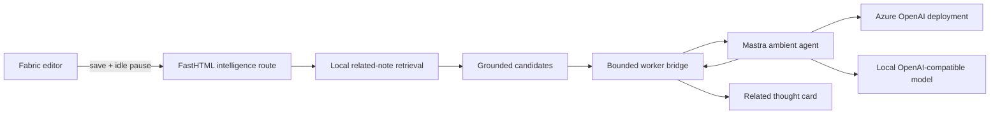

# Intelligence Architecture

## Product Boundary

Personal Note owns attention, retrieval, permissions, provenance, and presentation. Mastra owns bounded model execution. The model never receives database access, shell access, filesystem access, or mutation authority.



## Current Modules

### Browser Listener

`src/main.js` waits for a successful save and a meaningful idle pause. It sends only the active note ID and current text snapshot to `/api/intelligence/related`. Stale requests are cancelled, dismissed suggestions are suppressed for the session, and responses remain source-linked.

### Product Retrieval

`services.py` maintains an FTS5 index derived from Fabric text, excludes the active note, ranks grounded overlap, and returns at most five candidates with note ID, title, excerpt, notebook, score, confidence, and source timestamp. It also maintains deterministic person mentions in `note_people`. These indexes update in the same SQLite transaction as note writes and remain useful without any model.

### FastHTML Bridge

`routes.py` owns the public intelligence contract. `/api/intelligence/related` returns the strongest local candidate without calling a model. `/api/intelligence/related/enrich` is a separate cancellable slow lane; `intelligence_client.py` gives the worker a bounded configurable budget and falls back to the strongest local candidate when the worker is unavailable.

### Mastra Worker

`intelligence/ambient-agent.ts` currently performs one task: choose one candidate and phrase one restrained observation. It validates all input/output, caps candidates, uses one model step, rejects unknown note IDs, and treats note content as untrusted data.

`intelligence/server.ts` exposes only `/health` and `/rank`. It reports whether execution is local retrieval or model-backed and which provider family is active without revealing endpoint, deployment, or credentials.

## Latency Contract

The related-context path records separate retrieval, enrichment, request, and queue-to-presentation timings. The FastHTML response includes safe timing metadata and a `Server-Timing` header; the browser records the latest completed sample, cancellation count, and Open or Dismiss interaction without storing note text.

Typing cancels queued or in-flight ambient work immediately. Timing belongs to the product shell rather than Mastra, so swapping the worker does not change the measurement contract. The settings drawer shows the latest response mode and latency for development evaluation.

Local presentation never waits for Mastra. In the validated development configuration, local retrieval returned in 13 ms while model enrichment completed independently in 2,065 ms. The browser applies late enrichment only when the note, request sequence, and visible suggestion are still current.

The local person listener is a separate fast lane: it prefetches after 250 ms and presents after an 850 ms quiet gate. It calls the product-owned entity API directly and never invokes Mastra. Person results cite indexed note context and defer all navigation and presentation decisions to the browser shell.

Calendar detection is also local and framework-independent. `chrono-node` parses the actively edited phrase, the browser waits for the same 850 ms presentation gate, and the result remains a draft. The only consequential action is an explicit `.ics` download; detection alone never writes to a calendar or database.

## How To Add Capabilities

Add product capabilities as narrow read or proposal tools. Tools should call authenticated FastHTML APIs, not SQLite directly. Separate retrieval from action, and keep every write reversible.

Recommended structure:

```text
intelligence/
  agents/
    ambient-listener.ts
    project-curator.ts
  tools/
    search-notes.ts
    read-note-excerpt.ts
    list-commitments.ts
    compare-decisions.ts
    propose-note-link.ts
    propose-para-classification.ts
    record-attention-feedback.ts
  workflows/
    surface-related-context.ts
    assemble-project.ts
    weekly-tending.ts
  schemas/
    provenance.ts
    proposals.ts
```

## Next Tool Set

1. **`search_notes`**: Hybrid FTS5 and semantic retrieval with filters for notebook, time, person, project, and archive state.
2. **`read_note_excerpt`**: Fetch only a grounded source window and object coordinates, never an entire notebook by default.
3. **`compare_decisions`**: Contrast two or more source excerpts and identify changed assumptions with citations.
4. **`list_commitments`**: Return unresolved commitments tied to people, dates, and projects.
5. **`propose_note_link`**: Suggest a typed relationship between notes; user acceptance performs the mutation.
6. **`propose_para_classification`**: Suggest Project, Area, Resource, or Archive with confidence and evidence.
7. **`record_attention_feedback`**: Capture useful, irrelevant, too frequent, and never-show-again signals.

## Capability Phases

### Phase 1: Better Context

- Add SQLite FTS5 and provenance spans.
- Add hybrid reranking and attention-quality fixtures.
- Open a related card at the exact source object.

### Phase 2: Decisions And Commitments

- Extract decisions, people, dates, and commitments into derived records.
- Add comparison and unresolved-commitment tools.
- Surface only high-confidence, actionable context.

### Phase 3: Self-Organization

- Add reversible PARA proposals.
- Assemble project state from notes, tasks, decisions, and milestones.
- Add an agent activity ledger and feedback-derived quietness policy.

### Phase 4: External Depth

- Add browser captures and web research behind explicit permission.
- Add MCP so Hermes and other agents can consume the same safe tools.
- Route expensive research to cloud subscriptions while preserving local capture and retrieval.

## Invariants

- Raw notes remain canonical.
- Every observation cites a stored source.
- Model failure degrades to local retrieval, not application failure.
- No consequential write occurs without an explicit proposal or user-granted policy.
- Saved webpages and note text are untrusted input, never agent instructions.
- Tools are replaceable; the editor and note database do not depend on Mastra internals.
