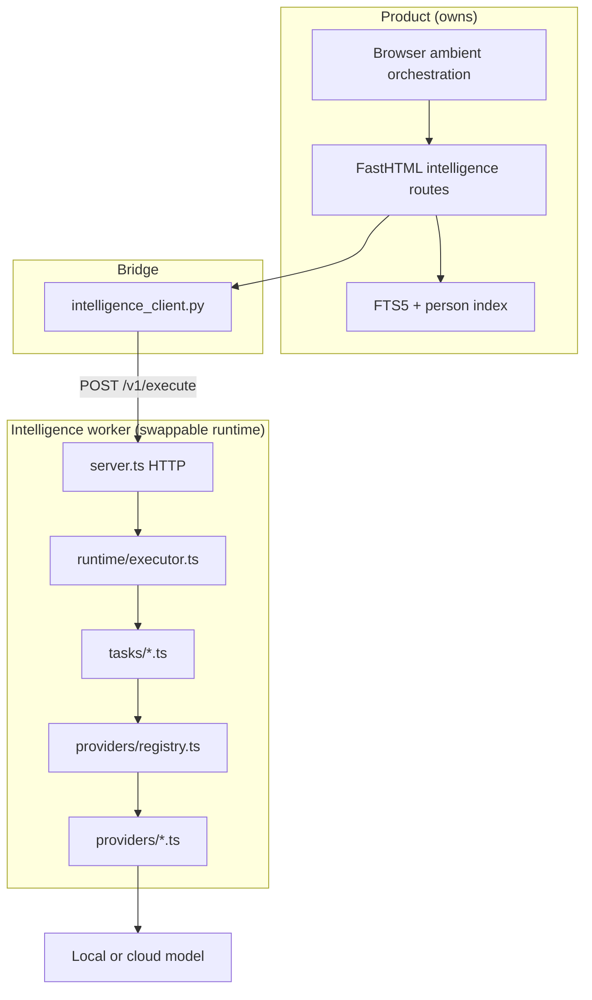

# Intelligence Protocol

Personal Note intelligence uses a **versioned wire protocol** so tasks, providers, and runtimes can be swapped without changing the product shell.

## Design Goals

1. **Local-first** — deterministic retrieval always works; models are optional enrichment.
2. **Swappable providers** — Ollama, LM Studio, Azure OpenAI, or pure deterministic logic via the same interface.
3. **Swappable runtime** — Mastra today; another agent runtime tomorrow, as long as it speaks this protocol.
4. **Fast lane + slow lane** — product never blocks on models; enrichment is cancellable.
5. **Explicit tiers** — `local-only`, `local-first`, `cloud-ok` control when cloud endpoints may run.

## Layer Model



| Layer | Location | Swap without touching |
|-------|----------|------------------------|
| Protocol schemas | `intelligence/protocol/` | Worker internals |
| Task handlers | `intelligence/tasks/` | Providers |
| Providers | `intelligence/providers/` | Tasks |
| Decision chain | `intelligence/providers/registry.ts` | HTTP routes |
| Python bridge | `intelligence_client.py` | Worker language |
| Product retrieval | `services.py` | Worker entirely |

## Protocol Version

Current version: **`1`** (`intelligence/protocol/version.ts`, `intelligence_protocol.py`).

Bump when request or response shapes change. Clients send `protocolVersion: "1"`; workers reject unknown versions in future.

## Endpoints

| Method | Path | Purpose |
|--------|------|---------|
| `GET` | `/health` | Worker status, tier, tasks, provider chain |
| `POST` | `/v1/execute` | **Canonical** task execution |
| `POST` | `/rank` | Legacy rank-only shortcut (backward compatible) |

FastHTML bridge prefers `/v1/execute`, falls back to `/rank` if needed.

## Execute Request

```json
{
  "protocolVersion": "1",
  "task": "rank-related",
  "input": {
    "currentText": "Talk to Maya about the launch...",
    "candidates": [
      {
        "noteId": 7,
        "title": "Launch timing",
        "notebookName": "My Notes",
        "notebookColor": "#267A9D",
        "excerpt": "Maya preferred September...",
        "reason": "Connected through launch and maya.",
        "sourceUpdatedAt": "2026-07-18 00:00:00",
        "score": 4,
        "confidence": 0.84,
        "mode": "local-retrieval"
      }
    ]
  },
  "preferences": {
    "tier": "local-first",
    "latencyBudgetMs": 4000
  }
}
```

### Tasks (v1)

| Task | Input | Output | Model needed? |
|------|-------|--------|---------------|
| `rank-related` | `currentText`, `candidates[]` | `selectedId`, `observation` | Optional |
| `scan-page` | local scan bundle (calendar, people, candidates, actions) | refined calendar titles, related observation, summary | Optional |

Future tasks (planned): `compare-decisions`, `extract-commitments`, `propose-para-classification`.

### Preferences

| Field | Values | Default |
|-------|--------|---------|
| `tier` | `local-only`, `local-first`, `cloud-ok` | `local-first` |
| `latencyBudgetMs` | 100–30000 | worker timeout |

### Intelligence tiers

| Tier | Behavior |
|------|----------|
| `local-only` | Deterministic + on-device models only (127.0.0.1 / localhost endpoints). Cloud endpoints skipped. |
| `local-first` | On-device models when configured. Cloud endpoints **not** used unless tier is `cloud-ok`. |
| `cloud-ok` | Model provider runs when configured, including cloud endpoints. |

Set via `PERSONAL_NOTE_INTELLIGENCE_TIER` in `.env`.

## Execute Response

```json
{
  "protocolVersion": "1",
  "task": "rank-related",
  "output": {
    "selectedId": 7,
    "observation": "This note revisits the same launch timing concern with Maya."
  },
  "execution": {
    "executor": "local-model",
    "provider": "openai-compatible",
    "latencyMs": 1842,
    "fallback": false,
    "tier": "local-first"
  },
  "mode": "mastra-model"
}
```

### Executor kinds

| Executor | Meaning |
|----------|---------|
| `deterministic` | No model; FTS5/rules fallback |
| `local-model` | On-device OpenAI-compatible endpoint |
| `cloud-model` | Azure OpenAI or remote API |

## Provider Chain (Decision Layer)

`selectProviderChain()` builds an ordered fallback list:

```text
local-first + Ollama configured  →  [local-model, deterministic]
local-first + Azure configured   →  [deterministic]  (cloud skipped)
cloud-ok + any model             →  [model, deterministic]
local-only + Ollama              →  [local-model, deterministic]
local-only + Azure               →  [deterministic]
no model configured              →  [deterministic]
```

On failure, the chain falls through to the next provider. Structured log: `event=intelligence.rank outcome=fallback`.

## Configuration

```text
# Tier (local-first recommended for daily use)
PERSONAL_NOTE_INTELLIGENCE_TIER=local-first

# Local model (Ollama example)
PERSONAL_NOTE_MODEL=qwen3:4b
PERSONAL_NOTE_MODEL_URL=http://127.0.0.1:11434/v1
PERSONAL_NOTE_MODEL_KEY=local

# Cloud (only used when tier=cloud-ok, or for future heavy tasks)
PERSONAL_NOTE_DEPLOYMENT_NAME=
PERSONAL_NOTE_MODEL_URL=https://your-resource.openai.azure.com/
PERSONAL_NOTE_MODEL_KEY=

# Worker
INTELLIGENCE_PORT=4112
INTELLIGENCE_URL=http://127.0.0.1:4112
INTELLIGENCE_ENRICH_TIMEOUT=4.0
```

Leave `PERSONAL_NOTE_MODEL` empty for pure deterministic mode.

## Local Model Recommendations

For an **80% local / 20% cloud** daily workflow on a typical laptop:

### Tier 1 — Always local (no model)

These already run without any model and should stay that way:

- FTS5 related-note retrieval
- Person mention index
- Calendar draft parsing (`chrono-node`)
- Page Scan geometry (diagram-assist)
- Tidy text layout

### Tier 2 — Light local model (ambient enrichment)

Best for `rank-related` and future one-shot phrasing tasks. Target **&lt;3 s** on CPU, **&lt;1 s** on GPU.

| Model | Size | Runtime | Notes |
|-------|------|---------|-------|
| **qwen3:4b** | ~2.5 GB | Ollama | Default recommendation; good reasoning at small size |
| **phi-4-mini** | ~2 GB | Ollama / LM Studio | Fast, strong for short classification/phrasing |
| **gemma3:4b** | ~3 GB | Ollama | Solid alternative for structured JSON output |
| **llama3.2:3b** | ~2 GB | Ollama | Widely available; adequate for rerank tasks |

```text
PERSONAL_NOTE_MODEL=qwen3:4b
PERSONAL_NOTE_MODEL_URL=http://127.0.0.1:11434/v1
PERSONAL_NOTE_INTELLIGENCE_TIER=local-first
```

### Tier 3 — Standard local model (future synthesis tasks)

For decision comparison, commitment extraction, project assembly — not yet implemented as protocol tasks.

| Model | Size | Runtime | Notes |
|-------|------|---------|-------|
| **qwen3:8b** | ~5 GB | Ollama | Better nuance; needs 8 GB+ RAM |
| **mistral-small** | varies | Ollama | Good prose quality |
| **llama3.1:8b** | ~4.7 GB | Ollama | General-purpose fallback |

### Tier 4 — Cloud (explicit opt-in)

Use when local models are insufficient or for long-context synthesis:

| Provider | Config | When |
|----------|--------|------|
| Azure OpenAI | `PERSONAL_NOTE_DEPLOYMENT_NAME` + endpoint | Production cloud, Foundry projects |
| OpenAI-compatible API | `PERSONAL_NOTE_MODEL` + remote URL | Third-party APIs |

Set `PERSONAL_NOTE_INTELLIGENCE_TIER=cloud-ok` to allow cloud endpoints.

### Packaging for end users

Recommended local stack for a downloadable app:

1. **Ollama** bundled or one-click installer — manages model downloads.
2. **Default model**: `qwen3:4b` or `phi-4-mini` pulled on first intelligence use.
3. **Tier**: `local-first` out of the box.
4. **Cloud**: optional BYOK in settings when user sets tier to `cloud-ok`.

## Adding a New Task

1. Add task name to `taskNameSchema` in `intelligence/protocol/schemas.ts`.
2. Implement handler in `intelligence/tasks/<task>.ts`.
3. Register in `intelligence/runtime/executor.ts`.
4. Add FastHTML route if product-facing (or call `execute_intelligence_task()` from bridge).
5. Add tests beside the task file.
6. Document input/output here.

## Adding a New Provider

1. Implement `IntelligenceProvider` in `intelligence/providers/`.
2. Register in `listProviders()` / `selectProviderChain()` in `registry.ts`.
3. No changes to product shell if existing tasks suffice.

## Replacing Mastra

Mastra is confined to `intelligence/providers/model.ts` (Agent wrapper). To swap:

1. Implement `IntelligenceProvider.generate()` with your runtime.
2. Register in the provider chain.
3. Keep `/v1/execute` and schemas unchanged.
4. Update `framework` field in capabilities if desired.

The product does not import Mastra types.

## Related Docs

- [INTELLIGENCE-ARCHITECTURE.md](./INTELLIGENCE-ARCHITECTURE.md) — attention policy, invariants
- [ARCHITECTURE.md](./ARCHITECTURE.md) — full system map
- [../AGENTS.md](../AGENTS.md) — agent contributor guide
