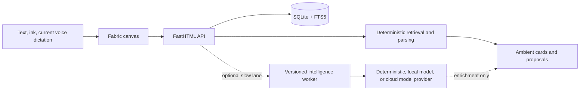
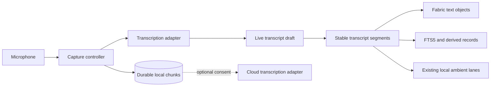

# Personal Note Product And Architecture Brief

Status: working reference, verified against the repository on 2026-08-07.

This is the first document to read when resuming the project. It explains the product intent, what is actually implemented, the architectural decisions already made, and the next decisions that still need evidence. Detailed contracts remain in the linked architecture, protocol, and roadmap documents.

## Product North Star

Personal Note is a **local-first spatial thinking tool**. Capture must feel immediate. The canvas should get out of the way, grow and shrink with the user's material, and quietly surface useful context without becoming a chat application.

The interface is inspired by the experience currently referred to as **Rod Io**. That name is a working reference only; the exact product, URL, and interaction details still need to be documented before treating it as a design specification.

The intended experience has four parts:

1. **Immediate capture** through voice, typing, pen, and pasted material.
2. **Spatial thought** on a direct-manipulation canvas that expands and contracts around content.
3. **Ambient assistance** that appears only when relevant, cites its source, and then leaves.
4. **User authority** over every consequential mutation, classification, export, or refinement.

The primary product differentiator is **concept-aware visual assistance**: Scan can understand a focused rough drawing well enough to polish it, complete one likely missing element, or propose one editable diagram for an abstract idea. Voice transcription is an important capture adapter, but it is not where the product should invent a new framework.

See `docs/VISUAL-INTELLIGENCE.md` for the visual proposal architecture and delivery sequence.

## Non-Negotiable Principles

- The capture path must never wait for a model.
- Raw notes, raw ink, and eventually raw audio remain canonical source material.
- Transcripts, indexes, links, entities, and summaries are derived and rebuildable.
- Local deterministic work runs first. Local or cloud model work is optional enrichment.
- Ambient intelligence is event-scoped, cancellable, quiet, and source-grounded.
- No framework owns the note model, attention policy, retrieval, or mutation authority.
- No permanent assistant or chat panel is introduced without an explicit product decision.
- Consequential changes are proposals that require approval and support undo.
- Provider credentials and private source material never leak into frontend configuration or logs.

## What Exists Today

| Area | Verified implementation | Maturity |
|------|-------------------------|----------|
| Spatial editor | Fabric.js canvas with text, ink, highlighting, erasing, object manipulation, undo/redo, and responsive page growth/shrink | Working product foundation |
| Persistence | FastHTML REST API, SQLite note storage, Fabric JSON as canonical note content | Working |
| Retrieval | SQLite FTS5 index rebuilt from Fabric text on each note write | Working |
| Related context | Local candidate retrieval after text save and idle pause; optional model rerank/rephrase | Complete prototype |
| People | Deterministic person index and source-linked ambient peek | Prototype |
| Calendar | Local `chrono-node` parsing and explicit `.ics` export | Prototype |
| Page Scan | Explicit scan for dates, people, related notes, text cleanup, and drawing proposals | Prototype |
| Drawing assistance | Local scan-time recognition of rough boxes, ellipses, connectors, and arrows; approval-gated refinement | Prototype |
| Concept-aware diagrams | Multi-stroke grouping, intent recognition, semantic completion, and ghost previews | Designed, not implemented |
| Voice | Browser `SpeechRecognition` inserts finalized text into a Fabric text object | Thin browser-dependent prototype |
| Model runtime | Optional TypeScript worker using Mastra for one bounded generation step | Replaceable implementation |
| Authentication | Deliberately bypassed in the current single-user build | Not implemented |
| Encryption and sync | SQLite is local storage only; no E2EE or sync protocol | Not implemented |

## Actual Runtime Shape

Development uses three processes: Vite on `5173`, FastHTML on `3137`, and the optional intelligence worker on `4112`.

The editor and local ambient lanes do not depend on Mastra. The worker accepts a versioned JSON protocol at `POST /v1/execute`; task handlers select a provider through a small internal interface. Mastra is currently used only inside the model provider.

## Ambient Intelligence As Built

Ambient behavior is orchestrated by the product shell in `src/main.js`:

- Text changes schedule a save and contextual checks.
- Calendar and person presentation use an 850 ms quiet gate.
- Related-note retrieval uses a 1,100 ms idle gate.
- Related retrieval returns locally before optional model enrichment starts.
- Sequence counters and `AbortController` discard stale work.
- Ink, erase, movement, and formatting cancel or avoid text intelligence.
- Each exact suggestion appears once per note per browser session.
- Page Scan is explicit and intentionally bypasses the ambient suppression ledger.

The product owns FTS5 retrieval, candidate filtering, provenance, attention policy, presentation, and approval. The worker receives bounded text and candidates, has no database or mutation access, and may return only a validated result.

## Voice And Audio: Current Gap

Voice is not yet an audio-first capture system. The current button uses the browser Web Speech API:

- There is no `MediaRecorder` or durable audio object.
- Browser and platform support determine whether dictation is available.
- The recognition service and privacy behavior are browser-dependent.
- Interim text is visual feedback only; finalized text is appended to one Fabric text object.
- Raw audio, timestamps, confidence, speaker turns, and transcript provenance are not stored.
- Finalized voice text currently takes the normal save path but does **not** request contextual calendar, person, or related-note checks.

This is useful as an interaction prototype, not as the primary capture architecture.

## Framework Decision

**Keep and strengthen the lightweight product-owned protocol. Do not build a general-purpose agent framework. Do not couple ambient intelligence to Mastra, AG-UI, or another orchestration framework.**

The repository already contains the right small substrate:

- Versioned Zod and Python wire schemas.
- Task handlers isolated from providers.
- A provider interface with deterministic fallback.
- Explicit `local-only`, `local-first`, and `cloud-ok` tiers.
- A bounded Python-to-worker bridge.
- Product-owned cancellation, latency measurement, retrieval, and UI policy.

That substrate should grow only when a concrete capability requires it. A replacement runtime needs to implement the provider interface or the `/v1/execute` contract; it should not require editor changes.

AG-UI remains isolated because its dependency graph is disproportionate for ambient work. It may be reconsidered for a long-running, visible workflow where streaming lifecycle events and human approval justify the cost. The current Mastra worker is acceptable for bounded model calls, but it is not part of the product's core architecture.

## Proposed Audio-First Architecture

Audio should be a separate capture pipeline, not another agent task:

Recommended boundaries:

1. **Capture controller** owns microphone permission, start/stop, chunking, interruption recovery, and immediate visual state.
2. **Audio store** writes chunks locally as they arrive so capture survives slow transcription or a worker failure.
3. **Transcription adapter** supports at least browser speech for prototyping and a local engine for the real local-first path. Cloud transcription is explicit opt-in.
4. **Transcript assembler** separates unstable partial text from stable timestamped segments and preserves corrections.
5. **Canvas adapter** projects stable segments into editable spatial text without making Fabric the audio database.
6. **Ambient trigger** runs only after a stable segment and a quiet pause; it reuses the existing deterministic lanes.

The first implementation should prefer a narrow `TranscriptionProvider` contract over a universal AI abstraction. Evaluate local engines against target devices before choosing packaging; model size, startup time, streaming support, CPU use, battery cost, and word error rate matter more than framework features.

## Latency Budgets

These are target budgets to validate with instrumentation, not current guarantees:

| Interaction | Target |
|-------------|--------|
| Capture button feedback | under 100 ms |
| Audio chunk accepted by local durable store | under 250 ms |
| First useful partial transcript | under 750 ms on a supported local device |
| Stable transcript projected to canvas | under 100 ms after finalization |
| Local ambient retrieval service time | under 100 ms typical, under 250 ms p95 |
| Ambient presentation | after a deliberate 700-1,200 ms quiet gate |
| Optional local model enrichment | under 3 s and never blocking local presentation |

Measure end-to-end perceived latency separately from service time. A fast query shown at the wrong moment is still a poor ambient interaction.

## Current Architectural Risks

- `src/main.js` combines canvas control, persistence orchestration, ambient policy, Page Scan, and voice behavior in one large module. New audio work should first extract narrow controllers rather than expand the file indefinitely.
- Browser speech recognition is not a dependable local-first or cross-browser foundation.
- FTS5 retrieval has no semantic ranking, object-level provenance span, or attention-quality fixture set yet.
- Model enrichment is optional and well-contained, but capability metadata still names Mastra directly; future UI should describe capabilities rather than framework brands.
- Authentication, tenant scoping, attachment storage, sync, and E2EE remain undesigned and constrain any cloud or multi-device audio plan.
- The exact Rod Io reference and the interaction principles borrowed from it are undocumented.

## Recommended Sequence

1. Document the exact Rod Io reference with screenshots or interaction notes and extract testable canvas behaviors from it.
2. Test the current canvas, Page Scan, and ambient suggestions with real note-taking sessions; record latency, false-positive, dismissal, and undo rates.
3. Collect real visual-thinking stroke fixtures and implement multi-stroke grouping plus nearby-label association.
4. Split Page Scan local findings from optional model enrichment so Scan never waits for a worker.
5. Add the bounded scene snapshot, diagram proposal schema, and reversible ghost preview described in `docs/VISUAL-INTELLIGENCE.md`.
6. Ship one high-precision semantic visual capability before attempting broad diagram generation.
7. Integrate a replaceable Whisper-class transcription provider when voice moves beyond the browser prototype.
8. Improve retrieval with provenance spans and evaluation fixtures before adding broader autonomous behavior.
9. Extract ambient, Scan, and capture orchestration from `src/main.js` as concrete modules become stable.

## Questions That Still Need Product Decisions

- Is audio canonical and retained by default, retained temporarily, or deleted after transcript confirmation?
- Must primary transcription work fully offline on the minimum supported device?
- Is voice continuous session capture, short dictation, or both?
- How should transcript segments occupy space: one growing object, timestamped blocks, or clustered cards?
- When may ambient intelligence interrupt during live speech, if ever?
- Which devices and browsers define the first performance target?
- What exactly does the Rod Io reference contribute: canvas physics, navigation, visual language, or capture flow?
- Is desktop packaging required to guarantee local models and durable audio storage?

## Resume Checklist For Future Sessions

1. Read this brief.
2. Read `docs/ARCHITECTURE.md` for the system and file map.
3. Read `docs/INTELLIGENCE-ARCHITECTURE.md` before changing attention or intelligence behavior.
4. Read `docs/INTELLIGENCE-PROTOCOL.md` before changing tasks, providers, or worker transport.
5. Read `docs/ROADMAP.md` to distinguish completed prototypes from planned work.
6. Preserve the invariants in `AGENTS.md`, especially local fallback, text-scoped ambient behavior, and proposal-gated mutations.
