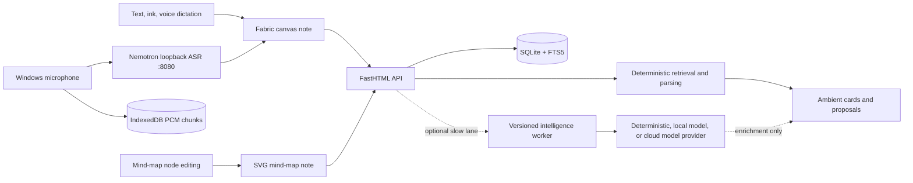
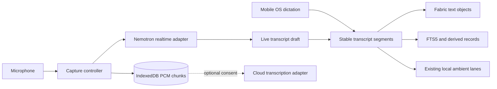

# Personal Note Product And Architecture Brief

Status: working reference, verified against the repository on 2026-08-10.

This is the first document to read when resuming the project. It explains the product intent, what is actually implemented, the architectural decisions already made, and the next decisions that still need evidence. Detailed contracts remain in the linked architecture, protocol, and roadmap documents.

## Product North Star

Personal Note is a **local-first spatial thinking tool**. Capture must feel immediate. Every workspace object begins as a note, while its type selects the right spatial editor. Canvas notes should get out of the way, grow and shrink with the user's material, and quietly surface useful context without becoming a chat application. Mind-map notes provide an infinite SVG workspace for branching thought without creating a separate library or persistence silo.

The interface is inspired by the experience currently referred to as **Rod Io**. That name is a working reference only; the exact product, URL, and interaction details still need to be documented before treating it as a design specification.

The intended experience has four parts:

1. **Immediate capture** through voice, typing, pen, and pasted material.
2. **Spatial thought** on a direct-manipulation canvas that expands and contracts around content.
3. **Ambient assistance** that appears only when relevant, cites its source, and then leaves.
4. **User authority** over every consequential mutation, classification, export, or refinement.

Voice is the **primary capture mode**. The primary product differentiator remains **concept-aware visual assistance**: Scan can understand a focused rough drawing well enough to polish it, complete one likely missing element, or propose one editable diagram for an abstract idea. Voice should use a narrow, replaceable transcription boundary rather than introduce a general AI framework.

See `docs/VISUAL-INTELLIGENCE.md` for the visual proposal architecture and delivery sequence.

## Non-Negotiable Principles

- The capture path must never wait for a model.
- Raw notes, raw ink, and eventually raw audio remain canonical source material.
- Transcripts, indexes, links, entities, and summaries are derived and rebuildable.
- Local deterministic work runs first. Local or cloud model work is optional enrichment.
- Ambient intelligence is event-scoped, cancellable, quiet, and source-grounded.
- No framework owns the note model, attention policy, retrieval, or mutation authority.
- No permanent assistant or chat panel is introduced without an explicit product decision.
- Consequential changes are proposals that require approval and support undo.
- Provider credentials and private source material never leak into frontend configuration or logs.

## What Exists Today

| Area | Verified implementation | Maturity |
|------|-------------------------|----------|
| Spatial editor | Fabric.js canvas with text, ink, highlighting, erasing, object manipulation, undo/redo, and responsive page growth/shrink | Working product foundation |
| Mind-map editor | Native infinite SVG branches with direct node editing, history, cleanup, minimap, image support, and JSON/PNG export | Working product foundation |
| Persistence | FastHTML REST API and one SQLite note store; immutable `note_type` selects canonical Fabric or mind-map JSON | Working |
| Retrieval | SQLite FTS5 index rebuilt from canvas text or mind-map node labels on each note write | Working |
| Related context | Local candidate retrieval after text save and idle pause; optional model rerank/rephrase | Complete prototype |
| People | Deterministic person index and source-linked ambient peek | Prototype |
| Calendar | Local `chrono-node` parsing and explicit `.ics` export | Prototype |
| Page Scan | Explicit scan for dates, people, related notes, text cleanup, and drawing proposals | Prototype |
| Drawing assistance | Local scan-time recognition of rough boxes, ellipses, connectors, and arrows; approval-gated refinement | Prototype |
| Concept-aware diagrams | Deterministic text-to-concept-map planning with an editable ghost preview and approval | Prototype complete |
| Agent workspace protocol | Transport-neutral semantic resources, grounded reads, scoped proposals, and adapter boundary | Architecture defined |
| Voice | Windows-owned 16 kHz PCM capture, durable IndexedDB chunks, local Nemotron streaming partials/finals, mobile OS dictation, and browser fallback | Working local-first prototype; physical-mic evaluation remains |
| Model runtime | Optional TypeScript worker using Mastra for one bounded generation step | Replaceable implementation |
| Authentication | Deliberately bypassed in the current single-user build | Not implemented |
| Encryption and sync | SQLite is local storage only; no E2EE or sync protocol | Not implemented |

## Actual Runtime Shape

Development uses three core processes: Vite on `5173`, FastHTML on `3137`, and the optional intelligence worker on `4112`. Windows local voice adds a separately started loopback ASR service on `8080`.

The editor and local ambient lanes do not depend on Mastra. The worker accepts a versioned JSON protocol at `POST /v1/execute`; task handlers select a provider through a small internal interface. Mastra is currently used only inside the model provider.

## Ambient Intelligence As Built

Ambient behavior is orchestrated by the product shell in `src/main.js`:

- Text changes schedule a save and contextual checks.
- Calendar and person presentation use an 850 ms quiet gate.
- Related-note retrieval uses a 1,100 ms idle gate.
- Related retrieval returns locally before optional model enrichment starts.
- Sequence counters and `AbortController` discard stale work.
- Ink, erase, movement, and formatting cancel or avoid text intelligence.
- Each exact suggestion appears once per note per browser session.
- Page Scan is explicit and intentionally bypasses the ambient suppression ledger.

The product owns FTS5 retrieval, candidate filtering, provenance, attention policy, presentation, and approval. The worker receives bounded text and candidates, has no database or mutation access, and may return only a validated result.

## Voice And Audio: Implemented State

Windows desktop now has an app-owned audio-first path:

- `MicrophonePcmCapture` converts microphone input to mono 16 kHz PCM16.
- `DurableAudioSession` writes ordered chunks and session metadata to IndexedDB before each chunk is sent for recognition.
- `LocalTranscriptionProvider` streams audio to `ws://127.0.0.1:8080/v1/realtime` and maps partial, final, error, and close events.
- Live partials remain transient feedback. Final text enters an editable Fabric text object and uses the normal contextual history/save/index path.
- Storage failure does not stop capture or transcription; the session reports degraded durability instead.
- Completed, cancelled, and interrupted sessions retain status, timestamps, chunk count, byte count, and duration.

The local engine is the Q8 build of `nvidia/nemotron-3.5-asr-streaming-0.6b`, served by pinned `NVIDIA/NeMo-Speech.cpp`. Deterministic speech validation produced live partials and a final transcript, and the measured CPU throughput was 3.2549x realtime after a 3.296-second warmup. A real physical-microphone session and first-partial latency still need manual validation because the automation browser denies microphone permission.

## Voice Target Decision

The first supported voice surfaces are mobile web on iOS and Android, plus Windows desktop. They intentionally use different recognition paths behind one transcript-session contract:

- **Mobile web:** delegate recognition to the operating system's keyboard dictation. Personal Note provides a focused text capture surface and accepts the resulting text; it does not claim local audio processing or attempt to bundle a model into a mobile browser.
- **Windows desktop:** use an application-owned, small local streaming model with no network requirement after installation. The recognizer must sit behind a replaceable provider boundary and must not block raw capture.
- **General web fallback:** retain browser `SpeechRecognition` only as a best-effort adapter. Its availability, network use, and privacy behavior are browser-dependent.
- **Future native mobile apps:** may use the same provider contract with an on-device model when native packaging exists. Training or fine-tuning a custom model should wait for a representative error corpus; the first release should benchmark suitable existing small models.

Mobile keyboard dictation returns text, not microphone audio, so durable raw-audio capture applies only when Personal Note owns the microphone session. The app must label these capabilities honestly rather than imply that all voice paths retain audio or run offline.

## Framework Decision

**Keep and strengthen the lightweight product-owned protocol. Do not build a general-purpose agent framework. Do not couple ambient intelligence to Mastra, AG-UI, or another orchestration framework.**

The repository already contains the right small substrate:

- Versioned Zod and Python wire schemas.
- Task handlers isolated from providers.
- A provider interface with deterministic fallback.
- Explicit `local-only`, `local-first`, and `cloud-ok` tiers.
- A bounded Python-to-worker bridge.
- Product-owned cancellation, latency measurement, retrieval, and UI policy.

That substrate should grow only when a concrete capability requires it. A replacement runtime needs to implement the provider interface or the `/v1/execute` contract; it should not require editor changes.

External agents require a different boundary from this internal task runner. The [Agent Workspace Protocol](./AGENT-WORKSPACE-PROTOCOL.md) defines stable semantic resources, bounded source-grounded reads, and proposal-gated changes. MCP, OpenClaw, embedded local agents, and future runtimes adapt to that product-owned contract rather than receiving database or canvas access.

AG-UI remains isolated because its dependency graph is disproportionate for ambient work. It may be reconsidered for a long-running, visible workflow where streaming lifecycle events and human approval justify the cost. The current Mastra worker is acceptable for bounded model calls, but it is not part of the product's core architecture.

## Audio-First Architecture

Audio should be a separate capture pipeline, not another agent task:

Recommended boundaries:

1. **Capture controller** owns microphone permission, start/stop, chunking, interruption recovery, and immediate visual state.
2. **Audio store** writes chunks locally as they arrive so capture survives slow transcription or a worker failure.
3. **Transcription adapter** supports mobile OS text input, best-effort browser speech, and a Windows local engine. Cloud transcription is explicit opt-in.
4. **Transcript assembler** separates unstable partial text from stable timestamped segments and preserves corrections.
5. **Canvas adapter** projects stable segments into editable spatial text without making Fabric the audio database.
6. **Ambient trigger** runs only after a stable segment and a quiet pause; it reuses the existing deterministic lanes.

The implementation uses a narrow provider contract rather than a universal AI abstraction. The local companion is explicitly installed and started on Windows; the ordinary hosted web app does not claim a bundled model. CPU throughput is sufficient for the current prototype, so CUDA remains deferred until real microphone evidence shows a latency problem.

## Latency Budgets

These are target budgets to validate with instrumentation, not current guarantees:

| Interaction | Target |
|-------------|--------|
| Capture button feedback | under 100 ms |
| Audio chunk accepted by local durable store | under 250 ms |
| First useful partial transcript | under 750 ms on a supported local device |
| Stable transcript projected to canvas | under 100 ms after finalization |
| Local ambient retrieval service time | under 100 ms typical, under 250 ms p95 |
| Ambient presentation | after a deliberate 700-1,200 ms quiet gate |
| Optional local model enrichment | under 3 s and never blocking local presentation |

Measure end-to-end perceived latency separately from service time. A fast query shown at the wrong moment is still a poor ambient interaction.

## Current Architectural Risks

- `src/main.js` still combines canvas control, persistence orchestration, ambient policy, Page Scan, and voice coordination; capture, storage, provider, and session behavior are now extracted into narrow modules.
- Browser speech recognition remains only a fallback and is not a dependable local-first or cross-browser foundation.
- IndexedDB audio is app-owned and durable in-browser, but retention controls, export, cleanup, and cross-device sync are not designed.
- FTS5 retrieval has no semantic ranking, object-level provenance span, or attention-quality fixture set yet.
- Model enrichment is optional and well-contained, but capability metadata still names Mastra directly; future UI should describe capabilities rather than framework brands.
- Authentication, tenant scoping, attachment storage, sync, and E2EE remain undesigned and constrain any cloud or multi-device audio plan.
- The exact Rod Io reference and the interaction principles borrowed from it are undocumented.

## Recommended Sequence

1. Manually validate a physical Windows microphone session and record first-partial latency.
2. Test cancellation, device interruption, reload recovery, and IndexedDB failure with real speech.
3. Measure correction rate, memory, CPU, battery cost, and punctuation quality on representative speech.
4. Decide retention, deletion, playback, and export controls for stored PCM sessions.
5. Keep CUDA deferred unless measured CPU latency fails the interaction budget.
6. Resume other product work only after the voice capture contract and retention behavior are accepted.

## Questions That Still Need Product Decisions

- Is audio canonical and retained by default, retained temporarily, or deleted after transcript confirmation?
- Is voice continuous session capture, short dictation, or both?
- How should transcript segments occupy space: one growing object, timestamped blocks, or clustered cards?
- When may ambient intelligence interrupt during live speech, if ever?
- What exactly does the Rod Io reference contribute: canvas physics, navigation, visual language, or capture flow?

## Resume Checklist For Future Sessions

1. Read this brief.
2. Read `docs/ARCHITECTURE.md` for the system and file map.
3. Read `docs/INTELLIGENCE-ARCHITECTURE.md` before changing attention or intelligence behavior.
4. Read `docs/INTELLIGENCE-PROTOCOL.md` before changing tasks, providers, or worker transport.
5. Read `docs/ROADMAP.md` to distinguish completed prototypes from planned work.
6. Preserve the invariants in `AGENTS.md`, especially local fallback, text-scoped ambient behavior, and proposal-gated mutations.
