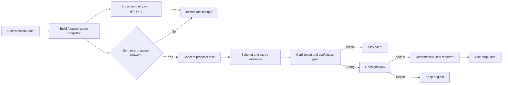

# Visual Intelligence Architecture

Status: active product architecture. The first local concept-to-diagram foundation is implemented in Scan; multi-stroke recognition and semantic completion remain proposed.

## Product Bet

Personal Note should not compete with an Obsidian vault by becoming another file tree or chat wrapper. Its distinctive value is a **thinking canvas that understands enough of a rough visual idea to offer one useful completion without taking over the page**.

The user remains the artist and author. The system acts like a restrained visual collaborator:

- It can polish a rough shape while preserving the hand-drawn character.
- It can recognize that several strokes and labels form one diagram.
- It can infer a likely visual grammar such as a flow, hierarchy, cycle, comparison, or system boundary.
- It can propose one missing node, connection, label, or completed concept.
- It can turn a rough object such as a hut into a cleaner version when the intent is sufficiently clear.
- It stays silent when the interpretation is ambiguous.

This is broader than shape recognition and narrower than autonomous diagram generation.

## Interaction Contract

**Scan remains the trigger.** There is no background image upload, per-stroke model call, or automatic replacement.

The first interaction should be:

1. The user draws and writes normally.
2. The user optionally selects or highlights the area that expresses the idea.
3. The user presses Scan.
4. Local findings appear after the existing sweep.
5. At most one concept proposal may arrive as a ghosted overlay.
6. The user accepts, rejects, or ignores it.
7. Acceptance is one undoable operation; rejection leaves the page untouched.

The proposal should answer one of three concise questions:

- **Clean this**: preserve meaning and make the selected visual more legible.
- **Complete this**: add the most likely missing visual element.
- **Show the idea**: propose one diagram for a nearby written concept.

These may eventually become explicit Scan modes. The first prototype should infer the mode from the selected material and return only one proposal type.

## Capability Ladder

| Level | Capability | Example | State |
|-------|------------|---------|-------|
| 0 | Stroke polish | Rough box becomes a softly regular box | Implemented prototype |
| 1 | Structural grouping | Four lines, two labels, and an arrow become one flow group | Next foundation |
| 2 | Intent recognition | Group is identified as a cycle, hierarchy, comparison, or process | Proposed |
| 3 | Bounded completion | Add one likely missing edge, node, roof, state, or label | Proposed differentiator |
| 4 | Concept visualization | Turn selected written text into one editable concept-map proposal | Implemented foundation |

Levels must be built in order. Semantic completion is unreliable without stable grouping, coordinates, labels, and proposal validation.

## Architecture



The model is not the renderer. It proposes a small scene-graph change; product code validates and renders that change locally.

## Three Representations

### 1. Canonical Canvas

Fabric JSON and raw ink points remain the source of truth. They are never replaced until the user accepts a proposal, and undo restores the exact source objects.

### 2. Focused Scene Snapshot

Scan converts only the relevant area into a compact, framework-neutral representation:

```json
{
  "scopeId": "scan-42",
  "bounds": { "left": 120, "top": 80, "width": 640, "height": 420 },
  "objects": [
    {
      "id": "stroke-1",
      "kind": "rough-shape",
      "geometry": "closed",
      "bounds": { "left": 160, "top": 120, "width": 140, "height": 90 },
      "label": "state",
      "confidence": 0.82
    },
    {
      "id": "edge-1",
      "kind": "connector",
      "from": "stroke-1",
      "to": "stroke-2",
      "confidence": 0.91
    }
  ],
  "nearbyText": ["update Q value", "reward", "next state"]
}
```

The actual schema should use numeric point arrays or normalized primitives rather than embedding SVG, executable code, or raw Fabric objects.

Selection and Highlighter intersections define the preferred scope. Without explicit focus, Scan may choose one settled stroke cluster, not the entire infinite page.

### 3. Diagram Proposal

The semantic lane returns a bounded proposal:

```json
{
  "proposalId": "proposal-7",
  "scopeId": "scan-42",
  "intent": "complete-process-loop",
  "summary": "Complete the update loop with a return edge from next state.",
  "confidence": 0.87,
  "operations": [
    {
      "op": "add-edge",
      "from": "stroke-2",
      "to": "stroke-1",
      "label": "repeat"
    }
  ]
}
```

Allowed operations should stay small: `add-node`, `add-edge`, `add-label`, `replace-shape`, `group`, and possibly `move` within the proposal bounds. The model cannot delete source objects, write arbitrary Fabric properties, move content outside the captured scope, or perform application actions.

## Recognition Strategy

Use a cascade rather than sending every page to a multimodal model.

### Stage A: Local Geometry

Runs in the browser during Scan:

- Detect primitive strokes.
- Cluster strokes by distance, overlap, temporal adjacency, and connector contact.
- Associate nearby text and handwriting labels.
- Infer candidate nodes and edges.
- Produce confidence and ambiguity signals.

This stage is private, fast, and deterministic. It also provides useful cleanup when no model is available.

### Stage B: Structured Semantic Reasoning

Send the compact scene snapshot and nearby text to the existing provider interface. A small text model can often infer visual grammar from labels and topology without seeing pixels. This should be tried before adding image transport.

Examples:

- `state -> action -> reward -> next state` suggests a learning loop.
- Two columns with opposing labels suggest a comparison.
- A central node with several outgoing edges suggests a hub or mind map.
- A rectangle plus a triangle above it suggests a hut or house.

### Stage C: Optional Vision Adapter

Use a raster crop only when vector structure is insufficient and the user has enabled a provider that can process images. The crop must be limited to the Scan scope, paired with the structured snapshot, stripped of unrelated page content, and governed by the local/cloud tier.

Vision is a fallback for semantic ambiguity, not the default transport.

Cloud vision requires just-in-time permission when a real request is ready to send. The permission prompt must identify the selected scope and provider; declining keeps the Scan local and does not disable local proposals. Do not show a speculative permission control before a cloud adapter exists.

### Stage D: Product Validation

Before showing a proposal, product code verifies:

- Every referenced source object exists in the captured scope.
- Every operation is in the allowed vocabulary.
- Coordinates stay within a padded proposal boundary.
- Added content is bounded in count and size.
- No source deletion or hidden mutation is requested.
- Confidence clears the threshold for that operation type.
- The proposal differs meaningfully from existing geometry.

## Timing Model

The user-triggered Scan permits deeper work than ambient text listeners, but it must still feel immediate.

| Phase | Target | Behavior |
|-------|--------|----------|
| Input snapshot | under 50 ms | Capture selection, highlighted objects, nearby labels, and vector points |
| Local geometry and grouping | under 150 ms typical | Run during the existing sweep |
| First findings | at the 1.4 s sweep boundary | Never wait for a model |
| Local concept proposal | under 2.5 s preferred | Add one preview if still current |
| Cloud concept proposal | under 5 s maximum | Explicitly allowed tier only; cancellable |
| Apply accepted proposal | under 100 ms | Deterministic render and one history entry |

The current `/api/intelligence/scan` route violates the desired split because it awaits worker enrichment before returning local findings. The first timing change should make `/scan` local-only and add a separate cancellable proposal endpoint, mirroring the existing related-note fast and slow lanes.

Proposal work is cancelled when the note changes, the scope changes, Scan closes, or another Scan starts. A late response never applies itself and should not reopen a dismissed card.

## Attention And Interference Policy

- Do not run semantic diagram analysis after every stroke.
- Do not show suggestion badges while the user is actively drawing.
- Do not replace raw ink automatically.
- Prefer the active selection, then Highlighter intersections, then one spatial cluster.
- Return at most one semantic proposal per Scan.
- Require a higher threshold for semantic additions than for geometric cleanup.
- Stay silent when two interpretations score similarly.
- Preserve the user's hand-drawn style unless they explicitly choose a formal style.
- Treat nearby note text as untrusted data, never model instructions.

“Ambient” here means context-aware and available at the right moment, not continuously interrupting.

## Proposed Modules

```text
src/intelligence/
  diagram-assist.js          # Existing primitive stroke analysis
  diagram-cluster.js         # Multi-stroke grouping and label association
  diagram-scene.js           # Focused scene snapshot builder
  diagram-preview.js         # Ghost overlay and deterministic rendering

intelligence/
  tasks/
    propose-diagram.ts       # One bounded semantic proposal
  protocol/
    schemas.ts               # Scene snapshot and proposal schemas
```

The product-facing API should expose separate lanes:

```text
POST /api/intelligence/scan              # Immediate deterministic findings
POST /api/intelligence/diagram/propose   # Optional cancellable proposal
```

The second endpoint may use deterministic templates, a local model, or an allowed cloud model through the same provider chain. Its output is always a proposal, never Fabric JSON.

## Evaluation Before Expansion

Build a fixture set from real pen input before choosing models. Include:

- Rough hut: rectangle, roof, door, and ambiguous partial variants.
- Simple process: two nodes and one arrow, with one missing return edge.
- Algorithm explanation: labeled states, actions, decisions, and loops.
- Comparison: two groups with labels and shared dimensions.
- Hierarchy or mind map: central concept and incomplete branches.
- Negative examples: handwriting, random doodles, equations, and intentionally irregular art.

Measure:

- Grouping accuracy.
- Proposal precision: was the offered interpretation useful?
- Acceptance, rejection, ignore, and immediate undo rates.
- Source preservation and undo fidelity.
- Time to first local finding and time to proposal.
- Silence quality on ambiguous input.
- Edit distance from accepted proposal to the user's final diagram.

Optimize for proposal precision and silence, not the number of suggestions.

## Delivery Sequence

1. Ship the local text-to-concept-map foundation with ghost preview, approval, editable Fabric primitives, persistence, and one-step undo. **Complete.**
2. Collect 20-30 real stroke fixtures across the examples above.
3. Implement multi-stroke clustering and nearby-label association locally.
4. Define and test the scene snapshot and proposal schemas.
5. Split local Scan response from optional enrichment.
6. Add deterministic visual-completion templates for grouped strokes.
7. Add `propose-diagram` through the provider interface and compare a small local model with an optional vision model.
8. Expand only when fixture precision, acceptance, and undo metrics support it.

## Decided Constraints

- Concept-to-diagram is the first capability.
- Scan infers the proposal mode initially rather than exposing mode controls.
- Local deterministic planning is preferred and remains available without a model.
- Cloud processing requires just-in-time permission for the selected scope.
- Accepted diagrams use normal editable Fabric paths and text so existing save, reload, and undo behavior applies.

## Open Decisions

- How much hand-drawn irregularity should the renderer preserve?
- Can a text model using the scene graph meet the quality bar, or is a local vision model required?
